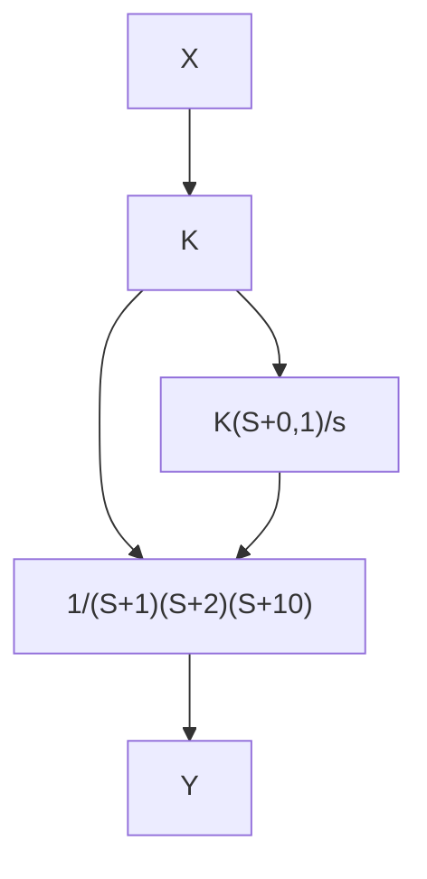

# Example 9.13

Let's get started with an example with a really simple root locus diagram:

$$P (s) = \frac {1}{(s + 1) (s + 2) (s + 1 0)}$$

To keep things simple we will use two simplied PID controllers:

$$C _ {1} (s) = K \quad C _ {2} (s) = \frac {K (s + 0 . 1)}{s}$$

Note that C1(s) is a Constant Gain controller and $C _ { 2 } ( s )$ is a Lead-Lag controller (with the pole at the origin).

flowchart

note that the PID version of these controllers is,

$$C _ {1} (s): \quad K _ {p} = K \quad K _ {I} = 0 \quad K _ {D} = 0C _ {2} (s): \quad K _ {p} = K \quad K _ {I} = 0. 1 K \quad K _ {D} = 0$$

Suppose we are asked to nd a type 1 controller with

$$T _ {s} \leq 8 \sec \% O S \leq 10 \%$$

Initially trying C1(s), draw the root locus and the performance lines:

text_image

90S ≤ 1090
-10
-2
-1
Ts ≤ 8sec

(Note that the angle of the diagonals is 54◦ corresponding to the %OS lookup table, and the shaded region does not meet our specs.)

Although there are clearly some values of K which will satisfy the specs, the system is NOT type 1. To get type 1, we have to add a factor of 1/s.
