# Modeling,imulationdol

natural_image

Pure mechanical cross-section diagram without any text, numbers, or symbols

natural_image

Pure electrical circuit diagrams showing a capacitor, coil, and damper (no text or symbols)

```mermaid
graph TD
    A[" "] --> B[" "]
    B --> C[" "]
    C --> D[" "]
    D --> E[" "]
    E --> F[" "]
    F --> G[" "]
    G --> H[" "]
    H --> I[" "]
    I --> J[" "]
    J --> K[" "]
    K --> L[" "]
    L --> M[" "]
    M --> N[" "]
    N --> O[" "]
    O --> P[" "]
    P --> Q[" "]
    Q --> R[" "]
    R --> S[" "]
    S --> T[" "]
    T --> U[" "]
    U --> V[" "]
    V --> W[" "]
    W --> X[" "]
    X --> Y[" "]
    Y --> Z[" "]
```

flowchart

line

| x | Line 1 | Line 2 |
| --- | --- | --- |
| 0 | 0 | 0 |
| 1 | 1 | 2 |
| 2 | 3 | 4 |
| 3 | 5 | 6 |
| 4 | 7 | 8 |
| 5 | 9 | 10 |
| 6 | 11 | 12 |
| 7 | 13 | 14 |
| 8 | 15 | 16 |
| 9 | 17 | 18 |
| 10 | 19 | 20 |
| 11 | 21 | 22 |
| 12 | 23 | 24 |
| 13 | 25 | 26 |
| 14 | 27 | 28 |
| 15 | 29 | 30 |
| 16 | 31 | 32 |
| 17 | 33 | 34 |
| 18 | 35 | 36 |
| 19 | 37 | 38 |
| 20 | 39 | 40 |
| 21 | 41 | 42 |
| 22 | 43 | 44 |
| 23 | 45 | 46 |
| 24 | 47 | 48 |
| 25 | 49 | 50 |
| 26 | 51 | 52 |
| 27 | 53 | 54 |
| 28 | 55 | 56 |
| 29 | 57 | 58 |
| 30 | 59 | 60 |
| 31 | 61 | 62 |
| 32 | 63 | 64 |
| 33 | 65 | 66 |
| 34 | 67 | 68 |
| 35 | 69 | 70 |
| 36 | 71 | 72 |
| 37 | 73 | 74 |
| 38 | 75 | 76 |
| 39 | 77 | 78 |
| 40 | 79 | 80 |
| 41 | 81 | 82 |
| 42 | 83 | 84 |
| 43 | 85 | 86 |
| 44 | 87 | 88 |
| 45 | 89 | 90 |
| 46 | 91 | 92 |
| 47 | 93 | 94 |
| 48 | 95 | 96 |
| 49 | 97 | 98 |
| 50 | 99 | 100 |
| 51 | - | - |
| 52 | - | - |
| 53 | - | - |
| 54 | - | - |
| 55 | - | - |
| 56 | - | - |
| 57 | - | - |
| 58 | - | - |
| 59 | - | - |
| 60 | - | - |
| 61 | - | - |
| 62 | - | - |
| 63 | - | - |
| 64 | - | - |
| 65 | - | - |
| 66 | - | - |
| 67 | - | - |
| 68 | - | - |
| 69 | - | - |
| 70 | - | - |
| 71 | - | - |
| 72 | - | - |
| 73 | - | - |
| 74 | - | - |
| 75 | - | - |
| 76 | - | - |
| 77 | - | - |
| 78 | - | - |
| 79 | - | - |
| 80 | - | - |
| 81 | - | - |
| 82 | - | - |
| 83 | - | - |
| 84 | - | - |
| 85 | - | - |
| 86 | - | - |
| 87 | - | - |
| 88 | - | - |
| 89 | - | - |
| 90 | - | - |
| 91 | - | - |
| 92 | - | - |
| 93 | - | - |
| 94 | - | - |
| 95 | - | - |
| 96 | - | - |
| 97 | - | - |
| 98 | - | - |
| 99 | - | - |
| Note: The actual values for the dashed lines are not provided in the code. The solid lines represent one data series. The solid lines represent another data series. There is only one data series labeled 'Orange Line'.

CRAIG A.KLUEVER
