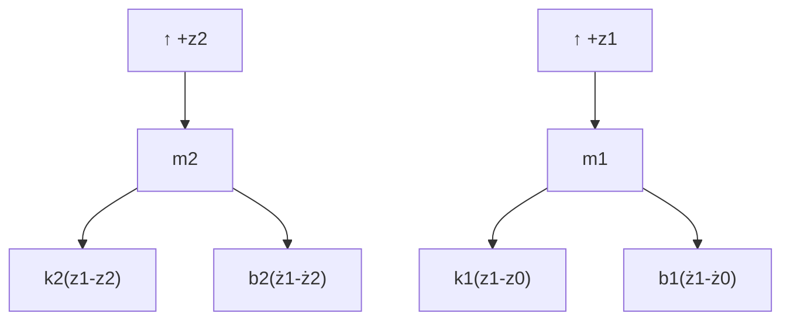

Figure 2.13 shows the FBDs of the two-mass mechanical system. The positive (upward) conventions for displacements $z _ { 1 }$ and $z _ { 2 }$ are also presented. Clearly, all spring and damper forces depend on the relative displacements and velocities between the seat mass and cabin floor, and the driver and seat masses, respectively. If we assume that relative displacement $z _ { 1 } - z _ { 0 }$ is positive, then the suspension spring $k _ { 1 }$ is in tension and the reaction force acts downward on seat mass $m _ { 1 }$ as shown in Fig. 2.13. Similarly, if we assume that relative displacement $z _ { 1 } - z _ { 2 }$ is positive, then the seat cushion is compressed and the reaction force acts downward on seat mass $m _ { 1 }$ and upward on driver mass $m _ { 2 }$ as shown by the equal-and-opposite spring force $k _ { 2 } ( z _ { 1 } - z _ { 2 } )$ in the FBD.

flowchart

Figure 2.13 Free-body diagram for the seat-suspension system (Example 2.3).

Friction forces depend on the relative velocities. If we assume that the relative velocity $\dot { z } _ { 1 } - \dot { z } _ { 0 }$ is positive $( \mathrm { i . e . }$ , the seat mass $m _ { 1 }$ is moving “away” from the cabin floor), then the reaction friction force $b _ { 1 } ( \dot { z } _ { 1 } - \dot { z } _ { 0 } )$ on mass $m _ { 1 }$ opposes the relative motion, as shown on the FBD. Similarly, if we assume that relative velocity $\dot { z } _ { 1 } - \dot { z } _ { 2 }$ is positive (i.e., the seat mass $m _ { 1 }$ is “approaching” the driver mass $m _ { 2 } )$ , then the seat cushion damping reaction force acts downward on seat mass $m _ { 1 }$ and upward on driver mass $m _ { 2 }$ as shown by the equal-and-opposite damper force $b _ { 2 } ( \dot { z } _ { 1 } - \dot { z } _ { 2 } )$ in the FBD. The reader should see that the FBDs in Fig. 2.13 remain valid if the assumed relative displacements and velocities are negative, in which case the force arrows are reversed. Finally, because displacements are referenced to the static equilibrium positions, the gravitational forces do not appear in the FBDs.

Summing all external forces with upward as the positive sign convention and applying Newton’s second law, we obtain
