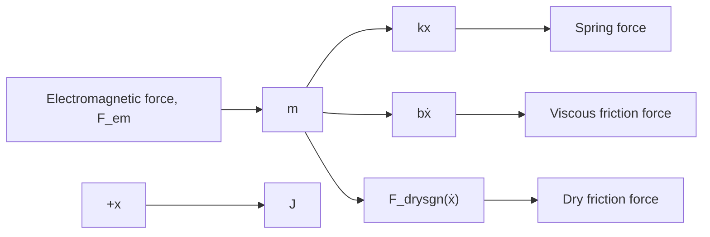

| Velocity | Dry friction force |
| --- | --- |
| 0 | F_dry |
| 0 | -F_dry |

Figure 2.15 Dry friction force as a function of velocity.

flowchart

Figure 2.16 Free-body diagram for the solenoid actuator with dry friction (Example 2.4).

Rearranging this equation with all dynamic variables on the left-hand side yields

$$m \ddot {x} + b \dot {x} + F _ {\mathrm{dry}} \operatorname{sgn} (\dot {x}) + k x = F _ {\mathrm{em}} \tag {2.26}$$

Equation (2.26) is the mathematical model of the mechanical component of the solenoid actuator system. It is nonlinear because of the inclusion of dry friction. If the dry friction force is ignored, Eq. (2.26) becomes the linear mathematical model of the actuator as derived in Example 2.1, or Eq. (2.21).
