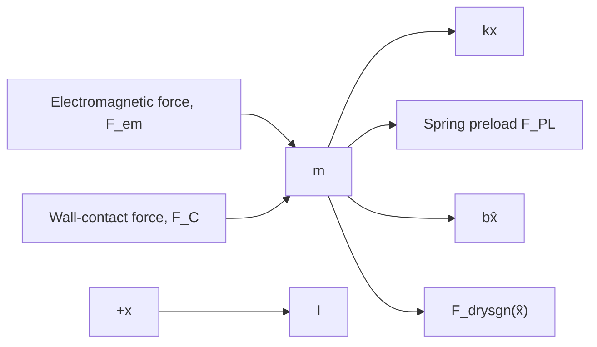

$$+ \rightarrow \sum F = F _ {\mathrm{em}} + F _ {C} - k x - F _ {\mathrm{PL}} - b \dot {x} - F _ {\mathrm{dry}} \mathrm{sgn} (\dot {x}) = m \ddot {x}$$

text_image

Seated
position (wall)
x
Electromagnetic
force, Fem
m
k
Preload FPL
Wall-contact
force, FC
b
Dry friction
Armature + spool valve

Figure 2.17 Solenoid actuator with preloaded return spring (Example 2.5).

flowchart

Figure 2.18 Free-body diagram for the solenoid actuator with preloaded return spring (Example 2.5).

Rearranging this equation with all dynamic variables on the left-hand side yields

$$m \ddot {x} + b \dot {x} + F _ {\mathrm{dry}} \operatorname{sgn} (\dot {x}) + k x = F _ {\mathrm{em}} - F _ {\mathrm{PL}} + F _ {C} \tag {2.27}$$

Equation (2.27) is the mathematical model of the mechanical system; however, we must account for the discontinuous wall-contact force $F _ { C }$ when the mass becomes unseated, or $x > 0$ . Clearly, when the system is in static equilibrium and the mass is in the seated position $( { \mathrm { i . e . , ~ } } { \ddot { x } } = { \dot { x } } = x = 0 )$ , the right-hand side of Eq. (2.27) must equal zero. In this case, the contact force balances the difference between the spring preload and electromagnetic forces, or $F _ { C } = F _ { \mathrm { P L } } - F _ { \mathrm { e m } } $ . However, when the electromagnetic force exceeds the spring preload force, a positive net force causes the mass to accelerate and eventually the mass is unseated and the contact force is zero. Therefore, the contact force is defined by

$$
F _ {C} = \left\{ \begin{array}{c c c} F _ {\mathrm{PL}} - F _ {\mathrm{em}} & \text { if } & F _ {\mathrm{em}} <   F _ {\mathrm{PL}} \\ 0 & \text { if } & F _ {\mathrm{em}} \geq F _ {\mathrm{PL}} \end{array} \right. \tag {2.28}
$$

Equations (2.27) and (2.28) constitute the mathematical model of the solenoid actuator–valve system with a preloaded spring. We revisit this solenoid actuator in Chapter 3 when we discuss electromechanical systems and in Chapter 6 when we discuss numerical simulations.
