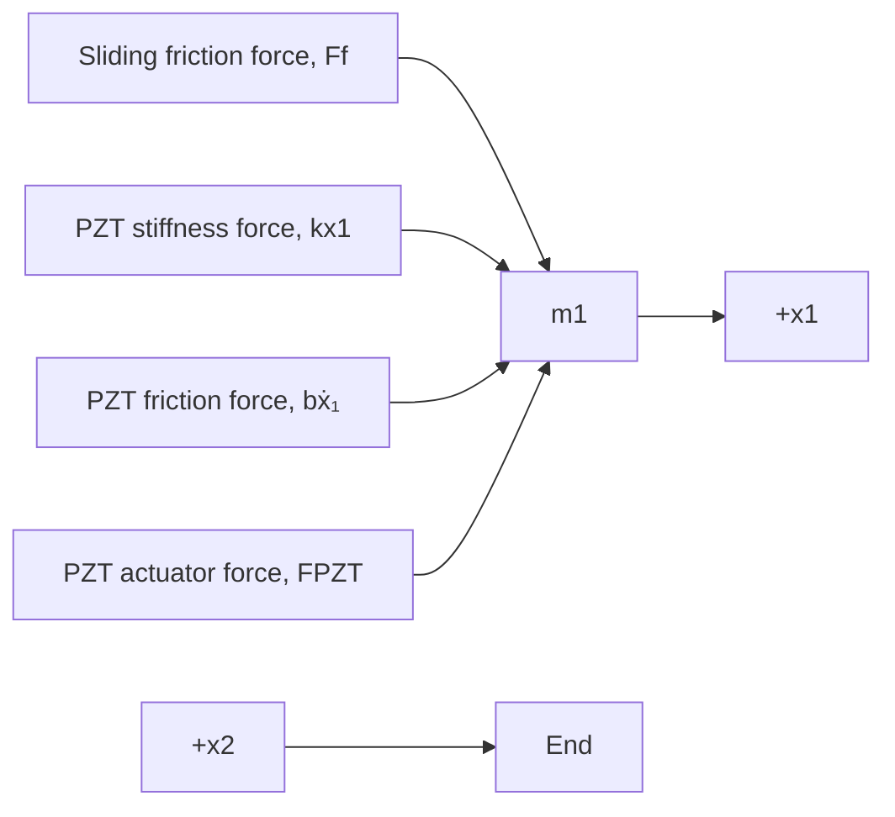

text_image

Slide mass
m2
x2
k
Dry friction
Clamp mass
Stiffness and friction
of PZT stack
m1
b
FPZT
x1

Figure 2.20 Mechanical model of the MEMS piezoelectric actuator (Example 2.6).

flowchart

Figure 2.21 Free-body diagram of the MEMS piezoelectric actuator where mass $m _ { \uparrow }$ slides relative to mass $m _ { 2 }$ (Example 2.6).

When the clamp mass is released from the slide mass at the end of the extension stroke, contact no longer exists between the two masses.

Figure 2.21 shows the FBD of the PZT actuator system. Stiffness and friction forces from the extended PZT actuator will act to the left as shown in Fig. 2.21. The PZT force $F _ { \mathrm { P Z T } }$ can only act on mass $m _ { 1 }$ to the right (extension). The friction force $F _ { f }$ that results from contact and relative motion between mass $m _ { 1 }$ and mass $m _ { 2 }$ is shown in Fig. 2.21 for the case where the velocity of the clamp mass $m _ { 1 }$ is greater than the velocity of the slide mass, or $\dot { x } _ { 1 } > \dot { x } _ { 2 }$ . This clamp-friction force $F _ { f }$ acts in equal-and-opposite pairs on the two masses according to Newton’s third law. Summing all external forces on clamp mass $m _ { 1 }$ and slide mass $m _ { 2 }$ with the sign convention as positive to the right yields

$\mathrm { C l a m p } \operatorname* { m a s s } \colon \quad +  \sum F = - F _ { f } - k x _ { 1 } - b \dot { x } _ { 1 } + F _ { \mathrm { P Z T } } = m _ { 1 } \ddot { x } _ { 1 }$

${ \mathrm { S l i d e ~ m a s s } } \colon \quad \quad +  \sum F = F _ { f } = m _ { 2 } { \ddot { x } } _ { 2 }$

Rearranging these equations with all dynamic variables on the left-hand side yields

$$m _ {1} \ddot {x} _ {1} + b \dot {x} _ {1} + k x _ {1} = F _ {\mathrm{PZT}} - F _ {f} \tag {2.29}m _ {2} \ddot {x} _ {2} = F _ {f} \tag {2.30}$$

When the clamp mass $m _ { 1 }$ is in contact with mass $m _ { 2 }$ , the sliding friction force is

$$F _ {f} = F _ {\text { dry }} \operatorname{sgn} (\dot {x} _ {1} - \dot {x} _ {2}) \tag {2.31}$$
