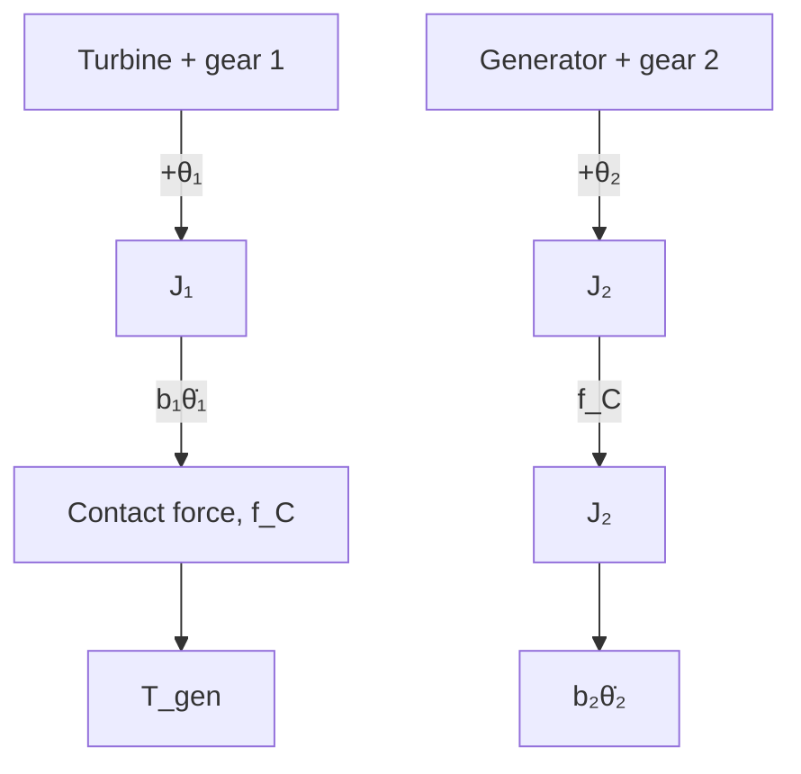

Figure 2.25 shows the FBD of the wind turbine generator system. The positive convention for angular rotations $\theta _ { 1 }$ and $\theta _ { 2 }$ is shown on the figure. The contact force $f _ { C }$ at the mesh point between the gears is illustrated as a pair of equal-and-opposite forces, in accordance with Newton’s third law. Because the aerodynamic torque $T _ { \mathrm { a e r o } }$ provides a positive torque to the input shaft, the contact force $f _ { C }$ provides a positive transmitted torque to the output (generator) shaft, which is equal to $f _ { C } r _ { 2 }$ . Summing the torques for each inertia element and applying Newton’s second law yields

$\mathrm { T u r b i n e : ~ ( + ~ c l o c k w i s e ) } \quad \ : \ : \ : \bigcap _ { i \in \mathrm { { \scriptsize ~ C } } } \ : \sum T = T _ { \mathrm { { a e r o } } } - b _ { 1 } \dot { \theta } _ { 1 } - f _ { C } r _ { 1 } = J _ { 1 } \ddot { \theta } _ { 1 }$ (2.40)

Generator: (+ counterclockwise) $\mathcal { \widehat { \sf { f } } } _ { \pm } \sum T = f _ { C } r _ { 2 } - b _ { 2 } \dot { \theta } _ { 2 } - T _ { \mathrm { g e n } } = J _ { 2 } \ddot { \theta } _ { 2 }$ (2.41)

flowchart

Figure 2.25 Free-body diagram of wind turbine generator system (Example 2.8).

Our wind turbine generator system has one degree of freedom as angular rotations $\theta _ { 1 }$ and $\theta _ { 2 }$ are not independent because of the gear train. The velocity of both gears at their mesh point is $r _ { 1 } \dot { \theta } _ { 1 } = r _ { 2 } \dot { \theta } _ { 2 }$ , and the time derivative of the mesh point velocity yields $r _ { 1 } \ddot { \theta } _ { 1 } = r _ { 2 } \ddot { \theta } _ { 2 }$ . Therefore, Eqs. (2.40) and (2.41) are not independent. We can use Eq. (2.41) to determine the unknown contact force $f _ { C }$

$$f _ {C} = \frac {1}{r _ {2}} (b _ {2} \dot {\theta} _ {2} + T _ {\mathrm{gen}} + J _ {2} \ddot {\theta} _ {2})$$

and substitute this expression into Eq. (2.40), which results in

$$J _ {1} \ddot {\theta} _ {1} + b _ {1} \dot {\theta} _ {1} = T _ {\text { aero }} - \frac {r _ {1}}{r _ {2}} (b _ {2} \dot {\theta} _ {2} + T _ {\text { gen }} + J _ {2} \ddot {\theta} _ {2}) \tag {2.42}$$
