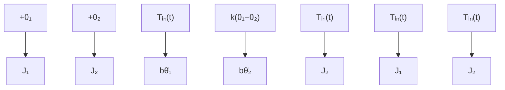

As with the previous examples, we start with an FBD of the coupled rotational mechanical system, shown in Fig. 2.27. Both disks are shown in the FBDs, with the positive (clockwise) angular displacements $\theta _ { 1 }$ and $\theta _ { 2 }$ . Input torque $T _ { \mathrm { i n } } ( t )$ is shown opposing the positive rotation for piston disk $J _ { 1 }$ and in the same direction as positive rotation for cylinder disk $J _ { 2 } ,$ , which is in agreement with the torque arrows given in Fig. 2.26. Both friction torques depend only on the angular velocities of the respective disks, and both torques oppose the positive rotation directions. The torque from twisting the torsional spring k depends on the relative angular displacement $\theta _ { 1 } - \theta _ { 2 }$ . If we assume that piston angle $\theta _ { 1 }$ is greater than cylinder angle $\theta _ { 2 }$ , then the twist in the torsional spring k will impart a negative reaction torque on piston disk $J _ { 1 }$ and an equal-and-opposite positive torque on cylinder disk $J _ { 2 }$ as shown in the FBD. Of course, piston angle $\theta _ { 1 }$ can be less than cylinder angle $\theta _ { 2 }$ . The reader should see that the spring torque arrows and corresponding equations shown in Fig. 2.27 remain valid in this case.

text_image

Piston
inertia, J₁
θ₁
Tᵢₙ(t)
Torsional
spring, k
Cylinder
inertia, J₂
θ₂
Tᵢₙ(t)
Friction, b
Friction, b

Figure 2.26 Mechanical model of the dual-disk generator for Example 2.9.

flowchart

Figure 2.27 Free-body diagram for the dualdisk generator system (Example 2.9).

Summing all external torques with clockwise as the positive sign convention and applying Newton’s second law for a rotational system, we obtain

$$\text { Disk 1: } \quad \bigoplus + \sum T = - k (\theta_ {1} - \theta_ {2}) - b \dot {\theta} _ {1} - T _ {\text { in }} (t) = J _ {1} \ddot {\theta} _ {1}\text { Disk 2: } \quad \bigoplus + \sum T = k (\theta_ {1} - \theta_ {2}) - b \dot {\theta} _ {2} + T _ {\text { in }} (t) = J _ {2} \ddot {\theta} _ {2}$$
