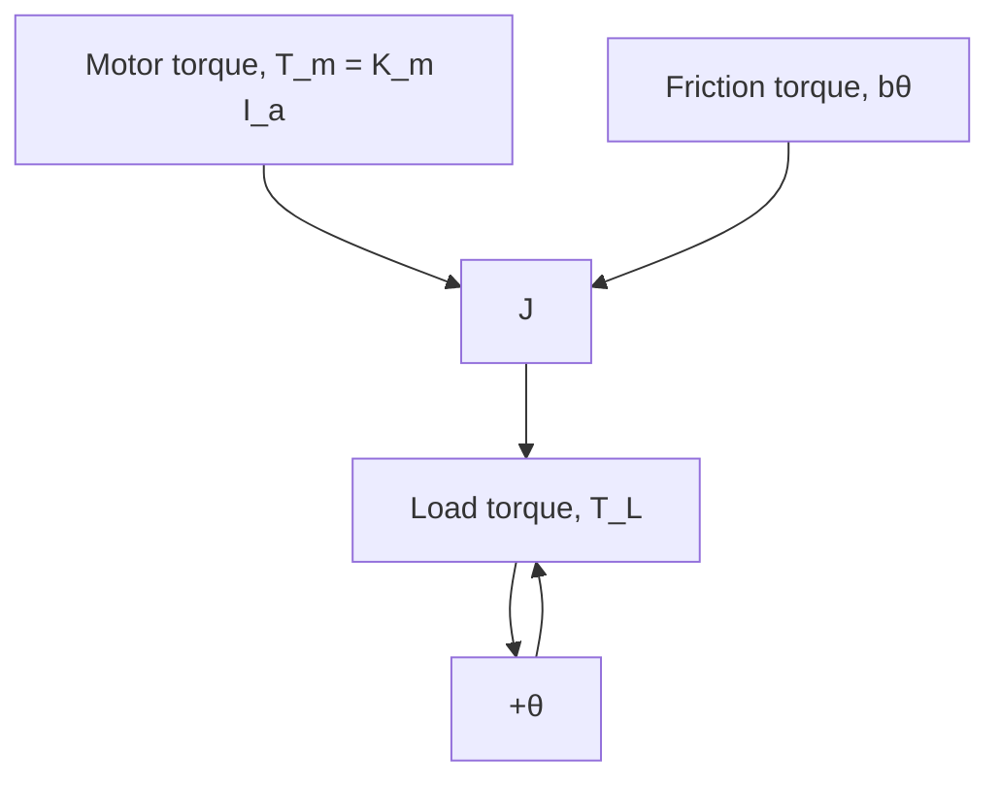

Figure 3.20 Free-body diagram of the DC motor armature rotor.

The complete mathematical model of the DC motor consists of the electrical system equation (3.87) and the mechanical system equation (3.88)

$$L _ {a} \dot {I} _ {a} + R _ {a} I _ {a} = e _ {\text { in }} (t) - K _ {b} \dot {\theta} \tag {3.89a}J \ddot {\theta} + b \dot {\theta} = K _ {m} I _ {a} - T _ {L} \tag {3.89b}$$

Therefore, we see that the mathematical model of the DC motor is third order: one first-order ODE for the armature circuit (one energy-storage element, $L _ { a } )$ and one second-order ODE for the mechanical rotor. The dynamic variables are armature current $I _ { a }$ and rotor angle ??, and the system input variables are armature voltage $e _ { \mathrm { i n } } ( t )$ and load torque $T _ { L }$ . Equations (3.89a) and (3.89b) are linear and coupled because they cannot be solved separately. The right-hand side of the mechanical system equation (3.89b) shows that a positive armature current produces a positive motor torque that in turn accelerates the armature rotor. However, the right-hand side of the armature equation (3.89a) shows that positive angular velocity of the rotor creates a negative induced voltage (the back emf) that in turn reduces the net voltage of the circuit.

Because the rotor’s angular position ?? does not appear in Eqs. (3.89a) and (3.89b), we may substitute $\omega = { \dot { \theta } }$ and $\dot { \omega } = \ddot { \theta }$ in order to develop a reduced-order model:

$$L _ {a} \dot {I} _ {a} + R _ {a} I _ {a} = e _ {\mathrm{in}} (t) - K _ {b} \omega \tag {3.90a}J \dot {\omega} + b \omega = K _ {m} I _ {a} - T _ {L} \tag {3.90b}$$

Now, the mathematical model of the DC motor is second order and consists of two coupled first-order ODEs. The solution to the second-order model will yield information for dynamic variables current $I _ { a } ( t )$ and angular velocity ??(t) but not angular position ??(t).
