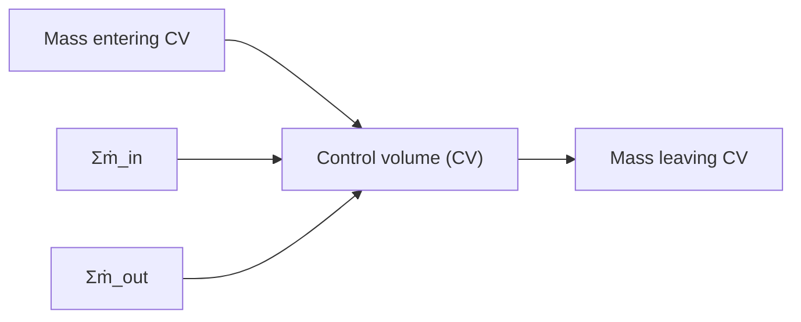

# Conservation of Mass

Mathematical models of fluid systems can be derived by applying the conservation of mass to a CV. Figure 4.7 shows a CV where mass could be entering (positive ṁ ) and leaving (negative ṁ ) through various paths. In addition, mass could be accumulating in the CV. The conservation of mass for the CV yields

$$\dot {m} _ {\mathrm{CV}} = \sum \dot {m} _ {\mathrm{in}} - \sum \dot {m} _ {\mathrm{out}} \tag {4.18}$$

flowchart

Figure 4.7 Control volume.

where $\dot { m } _ { \mathrm { { C V } } }$ is the net rate of change of the total fluid mass in the CV. If mass does not accumulate in the CV (i.e., steady flow through the CV) then $\dot { m } _ { \mathrm { C V } } = 0$ . We may rewrite the mass continuity equation (4.18) using the symbol w = ṁ for mass-flow rate

$$w _ {\mathrm{CV}} = \sum w _ {\text { in }} - \sum w _ {\text { out }} \tag {4.19}$$

The right-hand side terms of the mass continuity equation (4.19) are due to fluid flowing into and out of the CV through pipes, orifices, or valves. The left-hand side of Eq. (4.19) is the time derivative of the total mass contained in the CV, $m _ { \mathrm { C V } } = \rho V$

$$w _ {\mathrm{CV}} = \dot {m} _ {\mathrm{CV}} = \frac {d}{d t} (\rho V) = \dot {\rho} V + \rho \dot {V} \tag {4.20}$$

Therefore, the net mass-flow rate in the CV is affected by the changes in fluid density ?? and volume V. Let us now discuss different hydraulic systems that involve incompressible fluids (??̇ = 0) and compressible fluids $( \dot { \rho } \neq 0 )$ .
