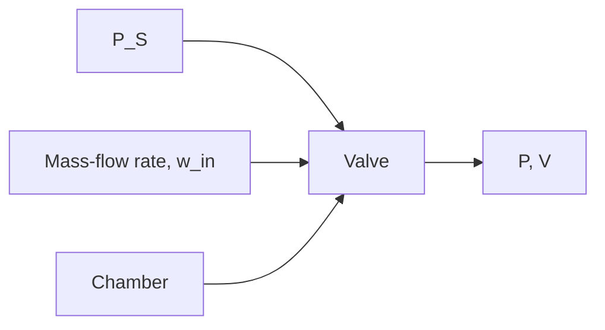

# Example 4.5

Figure 4.16 shows a simple pneumatic system that consists of a chamber with fixed volume V connected to an air-supply tank with constant pressure $P _ { S }$ . Derive the mathematical model of the pneumatic system assuming compressible flow through a sharp-edged orifice (valve) with throat area $A _ { 0 }$ .

0The rate of pressure change in the chamber is governed by Eq. (4.74), which is the fundamental modeling equation of a pneumatic vessel

$$\dot {P} = \frac {n R T}{V} \left(w _ {\text { in }} - \frac {P}{R T} \dot {V}\right) \tag {4.75}$$

flowchart

Supply tank   
Figure 4.16 Pneumatic system for Example 4.5.

where $w _ { \mathrm { i n } }$ is the mass-flow rate from the supply tank through the valve. Because chamber volume is constant we set ${ \dot { V } } = { \overset {  } { 0 } }$ in $\operatorname { E q } .$ (4.75) to obtain

$$C \dot {P} = w _ {\text { in }} \tag {4.76}$$

where the pneumatic capacitance for the fixed-volume vessel is

$$C = \frac {V}{n R T} \tag {4.77}$$

The mass-flow rate $w _ { \mathrm { i n } }$ for a compressible gas is governed by Eqs. (4.57) and (4.58) depending on whether the flow is unchoked (subsonic) or choked. Therefore, using the compressible flow equations the pressure-rate equation (4.76) becomes

$$C \dot {P} = C _ {d} A _ {0} P _ {S} \sqrt {\frac {2 \gamma}{(\gamma - 1) R T} \left[ \left(\frac {P}{P _ {S}}\right) ^ {\frac {2}{\gamma}} - \left(\frac {P}{P _ {S}}\right) ^ {\frac {\gamma + 1}{\gamma}} \right]} \quad \text { if } \quad P / P _ {S} > C _ {r} \tag {4.78}C \dot {P} = C _ {d} A _ {0} P _ {S} \sqrt {\frac {\gamma}{R T} C _ {r} ^ {\frac {\gamma + 1}{\gamma}}} \quad \text { if } \quad P / P _ {S} \leq C _ {r} \tag {4.79}$$
