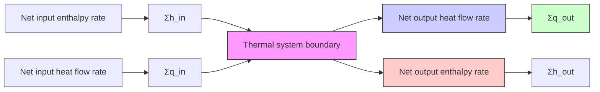

Thermal systems are generally more difficult to model compared to mechanical, electrical, or fluid systems. Temperature typically exhibits a spatial variation; that is, temperature usually varies between different points in a body. Therefore, temperature of a body could be represented as $T ( x , y , z , t )$ , which states that the temperature varies with the Cartesian coordinate location $( x , y , z )$ within the body as well as time t. Therefore, thermal systems are more accurately modeled as distributed systems, which require partial differential equations (PDEs) instead of ODEs as the modeling equations. In order to derive simplified, approximate thermal models, we assume that all points in a “thermal body” possess the same (average) temperature. This assumption allows us to derive lumped-parameter models where each “thermal body” (or thermal capacitance) has a single, uniform temperature. Therefore, our lumped-parameter thermal models are similar to our lumped-parameter fluid models, where each fluid capacitance (i.e., chamber or vessel) possesses a single pressure at each instant of time (i.e., there is no pressure variation within a fluid capacitance).

flowchart

Figure 4.17 Thermal system boundary for an open system.
