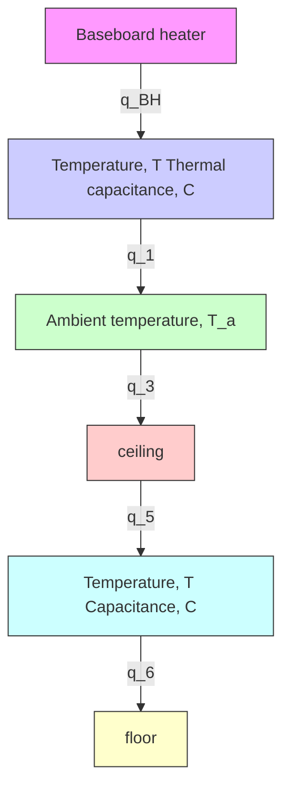

# Example 4.7

Figure 4.18 shows an interior office room with a baseboard heater, which can be modeled by a lumped-capacitance thermal system (e.g., see Reference 2). The air in the room has total thermal capacitance C and temperature T and the baseboard heater provides heat input $q _ { \mathrm { B H } }$ . The four walls and ceiling and floor surfaces are modeled by six different thermal resistances $( R _ { i } , i = 1 , 2 , . . . \widetilde { 6 } )$ ) due to the different materials, dimensions, and existence of a window or door for that surface. Derive the model of the thermal system.

Figure 4.19 shows the boundary of the thermal system and the heat flow rates. The system boundary is the rectangular volume enclosed by the four walls and ceiling and floor surfaces. Because the rectangular room has six surfaces (each modeled by a discrete thermal resistance) we show six outgoing heat flow rates $q _ { i } , i = 1 , 2 , \ldots , 6$ that are normal to each surface. The input heat from the baseboard heater is $q _ { \mathrm { B H } }$ . Because there is no mass crossing the system boundary, we use the energy balance equation (4.85) without the enthalpy-rate terms

$$C \dot {T} = \sum q _ {\text { in }} - \sum q _ {\text { out }} \tag {4.86}$$

text_image

North
door
window
Thermal resistance, R₁
Baseboard heater
q_BH
R₃
Temperature, T
Thermal capacitance, C
door
R₂
Top view

text_image

ceiling, R₅
door
East view
floor, R₆

Figure 4.18 Thermal system: interior room with baseboard heater (Example 4.7).

flowchart

Figure 4.19 Thermal system boundary and heat flow rates (Example 4.7).
