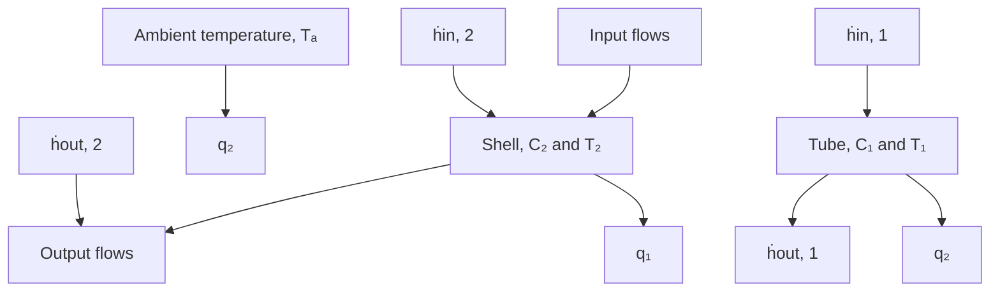

Input flow to shell
\dot{m}_{in, 2} = \dot{m}_2
Shell
Thermal
resistance, R_2
Input flow
to tube
\dot{m}_{in, 1} = \dot{m}_1
Tube fluid temperature, T_1
Shell fluid temperature, T_2
Tube
Thermal
resistance, R_1
Output flow
from tube
\dot{m}_{out, 1} = \dot{m}_1
Output flow
from shell
\dot{m}_{out, 2} = \dot{m}_2

Figure 4.20 Double-pipe heat exchanger (Example 4.8).

flowchart

Figure 4.21 Heat exchanger thermal boundaries and heat flow rates (Example 4.8).

Next, use the thermal resistance equation (4.81) to define each heat-transfer rate as $q _ { 1 } = ( T _ { 1 } - T _ { 2 } ) / R _ { 1 }$ (tube to shell fluid) and $q _ { 2 } = ( T _ { 2 } - T _ { a } ) / R _ { 2 }$ (shell fluid to surroundings). Furthermore, substitute the enthalpy rate equation ${ \dot { h } } = { \dot { m } } c _ { p } T$ into Eqs. (4.93) and (4.94) for each fluid stream to yield

$$C _ {1} \dot {T} _ {1} = \dot {m} _ {1} c _ {p, 1} T _ {\text { in }, 1} - \dot {m} _ {1} c _ {p, 1} T _ {1} - \frac {T _ {1} - T _ {2}}{R _ {1}} \tag {4.95}C _ {2} \dot {T} _ {2} = \dot {m} _ {2} c _ {p, 2} T _ {\text { in }, 2} - \dot {m} _ {2} c _ {p, 2} T _ {2} + \frac {T _ {1} - T _ {2}}{R _ {1}} - \frac {T _ {2} - T _ {a}}{R _ {2}} \tag {4.96}$$

Note that we must use two distinct specific heats $c _ { p , 1 }$ and $c _ { p , 2 }$ because the tube fluid is a chemical solution and the shell fluid is water. Finally, we can move all dynamic variables $( T _ { 1 }$ and $T _ { 2 } )$ to the left-hand sides of Eqs. (4.95) and (4.96) to obtain

$$R _ {1} C _ {1} \dot {T} _ {1} + R _ {1} \dot {m} _ {1} c _ {p, 1} T _ {1} + T _ {1} - T _ {2} = R _ {1} \dot {m} _ {1} c _ {p, 1} T _ {\text { in }, 1} \tag {4.97}R _ {1} R _ {2} C _ {2} \dot {T} _ {2} + R _ {1} R _ {2} \dot {m} _ {2} c _ {p, 2} T _ {2} + (R _ {1} + R _ {2}) T _ {2} - R _ {2} T _ {1} = R _ {1} R _ {2} \dot {m} _ {2} c _ {p, 2} T _ {\text { in }, 2} + R _ {1} T _ {a} \tag {4.98}$$
