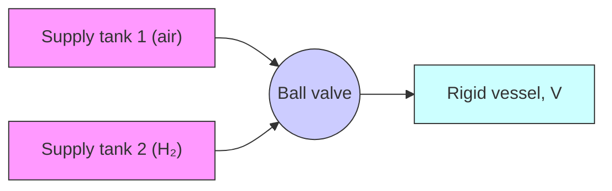

Figure P4.4

4.5 Figure P4.5 shows a centrifugal pump that supplies input volumetric-flow rate $Q _ { \mathrm { i n } }$ to the hydraulic tank. The pump takes water from the sump (reservoir) at atmospheric pressure and increases the pressure according to the equation

$$\Delta P = a \omega^ {2} \mathrm{Pa}$$

where ?? is the angular velocity of the centrifugal pump in revolutions per minute (rpm) and a is a constant derived from empirical data. Flow through output valve 2 is assumed to be laminar.

a. Assuming that the flow through valve 1 is laminar (i.e., $R _ { 1 } = R _ { L } )$ ) derive the mathematical model with pressure $P$ as the dynamic variable and pump speed ?? as the input variable.   
b. Repeat part (a) assuming that the flow through valve 1 is turbulent where $R _ { 1 } = R _ { T }$

text_image

Pump
Valve, R₁
Input flow
Qᵢₙ
Sump
(reservoir)
h
Area, A
Base pressure, P
Valve, R₂
Qₒᵤₜ

Figure P4.5

4.6 Figure P4.6 shows a pneumatic system that consists of a rigid vessel, and an inlet pipe with valve that can be connected to two separate supply tanks (air or hydrogen). Suppose the fluid resistance across the valve is laminar and independent of the type of gas. Both supply tanks have the same constant pressure, and the process is assumed to be isothermal and at $4 0 ^ { \circ } \mathrm { C }$ in both cases. If the rigid vessel is independently pressurized with either supply tank, will the corresponding pressure response profiles of the vessel be identical or different? Explain your answer.

flowchart

Figure P4.6

4.7 Figure P4.7 shows a rigid vessel with input volumetric-flow rate, $Q _ { \mathrm { i n } }$ . The hydraulic fluid has fluid bulk modulus $\beta = 1 . 2 ( 1 0 ^ { 9 } )$ Pa. At the instant shown the pressure in the chamber is $\dot { P } = 1 . 8 ( 1 0 ^ { 6 } )$ Pa, temperature is $T = 3 4 5 \mathrm { K }$ , and the volumetric-flow rate is $Q _ { \mathrm { i n } } { = } 2 . 4 ( 1 0 ^ { - 6 } ) \mathrm { m } ^ { 3 } / \mathrm { s }$ .
