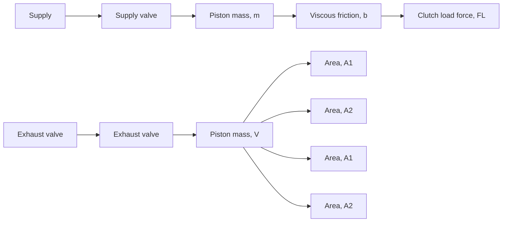

4.20 Figure P4.20 shows an electropneumatic clutch actuation system for heavy-duty trucks [3]. An electronic control unit (not shown) sends a signal to fully open either the supply or exhaust valve. When the supply valve is open, high-pressure air from the supply tank flows through the valve to the cylinder chamber. When the exhaust valve is open, air flows from the cylinder chamber to the surroundings. The two valves cannot be open at the same time. The constant supply pressure is $P _ { S }$ and the ambient pressure is $P _ { \mathrm { a t m } } .$ . Fully open orifice area is $A _ { 0 }$ for both valves. For normal operation the supply pressure is much greater than the chamber pressure P and the chamber pressure is significantly greater than ambient pressure $P _ { \mathrm { a t m } }$ . Therefore, we can assume that the supply and exhaust valve flows are always choked. Force $F _ { L }$ is the reaction force caused by displacing the clutch compression spring when engaging the clutch plates. The chamber volume is $V = V _ { 0 } + A _ { 1 } x$ where $V _ { 0 }$ is the volume when the piston displacement is zero. Derive the complete mathematical model of the electropneumatic system.

flowchart

Figure P4.20

4.21 Figure P4.21 shows a cross-sectional view of a rectangular volume of air mass that is surrounded on five sides by a perfect insulator (zero heat transfer). The sixth (right) side is a square area of cardboard that is 0.015 m thick. The dimensions of the air-mass volume are 0.4 m long, 0.2 m high, and 0.2 m wide. The air is initially at $3 5 ^ { \circ } \mathrm { C }$ and the ambient temperature is $T _ { a } = 2 5 ^ { \circ } \mathrm { C }$ . Search the engineering literature for the appropriate physical constants required for this problem and then answer the following questions:

a. Derive the mathematical model of the thermal system.   
b. Compute the initial heat-transfer rate q(0) to the surroundings.   
c. Compute the initial time-rate of the internal air temperature $\dot { T } ( 0 )$ .
