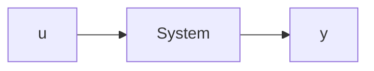

# 5.5 INPUT-OUTPUT EQUATIONS

In the previous sections, we developed state-variable equations and, in the case of linear systems, the SSR. We also presented a linearization process that can take the nonlinear state-variable equations and develop a linear state-space model. In general, the state-variable and state-space equations will involve a collection of first-order, coupled differential equations, which means that they must be solved simultaneously. In this section we develop input-output (I/O) equations that are solely a function of the desired output and input variables and their derivatives.

flowchart

Figure 5.5 Single-input, single-output system.

Consider a single-input, single-output (SISO) dynamic system shown in Fig. 5.5, represented by the generic “block diagram” or “black-box” diagram. For an SISO system, an I/O equation involves only input variable u and output variable y and their derivatives:

$$a _ {n} y ^ {(n)} + a _ {n - 1} y ^ {(n - 1)} + \dots + a _ {2} \ddot {y} + a _ {1} \dot {y} + a _ {0} y = b _ {m} u ^ {(m)} + \dots + b _ {1} \dot {u} + b _ {0} u \tag {5.85}$$

where $y ^ { ( n ) } = d ^ { n } y / d t ^ { n } , y ^ { ( n - 1 ) } = d ^ { n - 1 } y / d t ^ { n - 1 }$ , and so on. In general, the highest derivative of the input variable is less than or equal to the highest derivative of the output variable, or $m \leq n .$ . For a time-invariant system, the coefficients $a _ { i }$ and $b _ { i }$ are constants. Equation (5.85) is the general form of an I/O equation for an SISO system. For systems with two or more inputs, the right-hand side of the I/O equation will involve additional input terms. If we have a system with p output variables, we will have $p$ I/O equations, one for each output variable. Therefore, unlike the coupled state-variable equations, we can solve each I/O equation independently of the others. The following examples illustrate the derivations of I/O equations.
