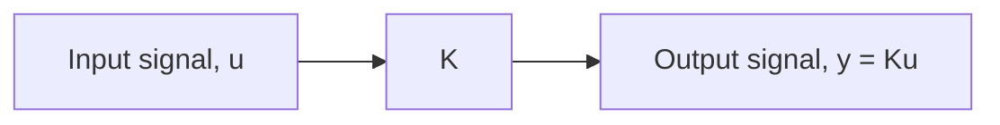
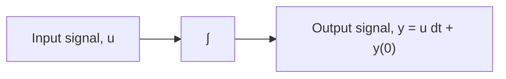
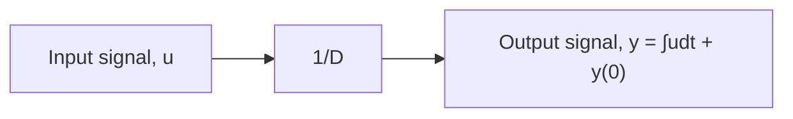
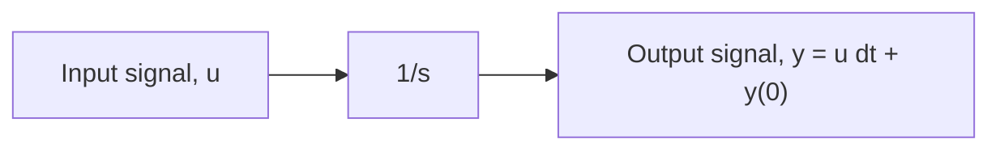
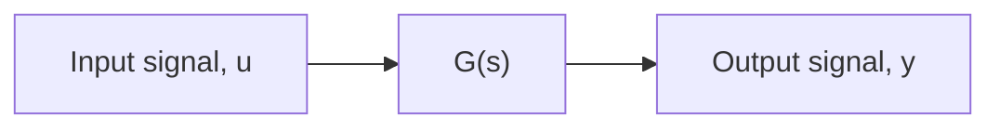

# Standard Block-Diagram Components

Figure 5.8 shows the multiplication of input signal u by the constant (or gain) K to produce the output signal y. Simulink uses a triangle-shaped block for a gain, since it is the traditional symbol for an operational amplifier (“op amp”) used to boost electrical signals.

Figure 5.9 shows three blocks that represent the time integration of input signal u. Figure 5.9b shows integration as the inverse of the differential or D operator, while Fig. 5.9c uses the transfer function 1∕s to denote integration. Simulink uses the 1∕s block in Fig. 5.9c to represent integration. The initial value of the integrator output, y(0), can be set in the Simulink environment (see Chapter 6 and Appendix C).

Figure 5.10 shows a transfer function block that represents an I/O differential equation. For example, if the transfer function G(s) in Fig. 5.10 is

$$G (s) = \frac {3 s + 2}{s ^ {2} + 4 s + 2 0} \tag {5.111}$$

flowchart

Figure 5.8 Gain block.

flowchart

flowchart

flowchart

Figure 5.9 Integrator blocks: (a) integral symbol, (b) D-operator symbol, and (c) transfer-function symbol.

flowchart

Figure 5.10 Transfer function block.

