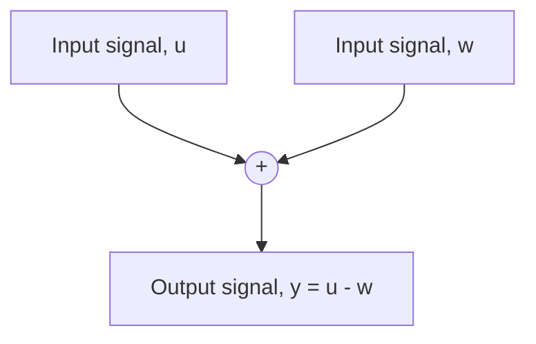

flowchart

Figure 5.11 Summing junction.

the corresponding I/O equation is

$$\ddot {y} + 4 \dot {y} + 2 0 y = 3 \dot {u} + 2 u \tag {5.112}$$

It is important to note that the transfer function G(s) represents the I/O relationship or mathematical model of a dynamic system and is independent of the nature of the input function u(t). For example, if we apply an arbitrary input signal (such as a constant or a sinusoidal function) to the block diagram shown in Fig. 5.10, the output y(t) will be determined by the I/O equation (5.112).

We often need to represent the addition and subtraction of dynamic variables in a block diagram. Figure 5.11 shows a common component known as a summing junction. We must include a plus or minus sign with each input signal to indicate addition or subtraction.
