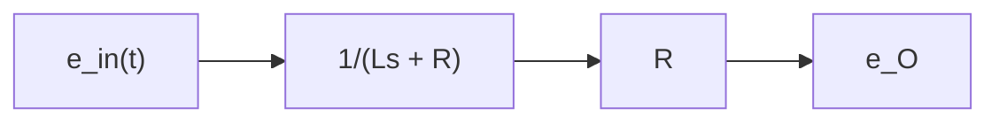
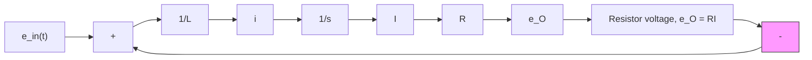

A second block diagram is drawn for this system using an integrator block instead of a transfer function block. The key to drawing a system block diagram using integrator blocks is to write the mathematical model in state-variable form and then send signal paths that represent each right-hand side of the state equations to separate integrators. Because this example involves a first-order system, we need only one integrator block. We begin by rewriting the modeling equation (5.113) as a state-variable equation

$$\dot {I} = \frac {1}{L} \left(e _ {\text { in }} (t) - R I\right) \tag {5.116}$$

Equation (5.116) shows that the signal path that represents $d I / d t$ can be constructed by computing the difference between the input voltage $e _ { \mathrm { i n } } ( t )$ and the resistor voltage $e _ { O }$ and multiplying this difference by the gain block $1 / L$ . Figure 5.14 shows the block diagram using this approach, where the summing junction is used to compute the voltage difference $e _ { \mathrm { i n } } ( t ) - R I .$ . The output of the integrator is current I, which is multiplied by resistance R to produce

flowchart

(a)

text_image

e_{in}(t)\n\frac{R}{Ls+R}\neq e_O

(b)   
Figure 5.13 Block diagrams for Example 5.16: (a) two blocks in series and (b) single equivalent block.

Source voltage

flowchart

Figure 5.14 Block diagram for Example 5.16 using an integrator block.

the desired output. Note that the output voltage $e _ { O }$ is “fed back” to the summing junction. The reader should also note that all signals at a summing junction must have the same units, which are volts in this case.
