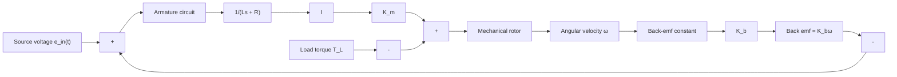

We are now ready to construct the overall block diagram of the DC motor. The armature circuit transfer function (5.120) will appear first in the diagram, as its output variable (current I) determines the motor torque $K _ { m } I .$ This torque is an input to the mechanical transfer function. Figure 5.15 shows the complete block diagram of the DC motor. Note that we have used two summing junctions to construct the input signals $u _ { 1 } = e _ { \mathrm { i n } } ( t ) - K _ { b } \omega$ and $u _ { 2 } = K _ { m } I - T _ { L }$ . The first summing junction produces the “net voltage” input to the armature circuit, and the second summing junction produces the “net torque” input to the mechanical rotor. The output of the circuit transfer function (current I) is gained by the constant $K _ { m }$ to produce the motor torque. In a similar fashion, the output of the mechanical transfer function (angular velocity ??) is gained by the constant $K _ { b }$ to produce the “back-emf” voltage that is fed back to the source voltage. Note that the signals at each summing junction have the same units (volts in the first junction, N-m in the second junction).

flowchart

Figure 5.15 Block diagram of the DC motor (Example 5.17).
