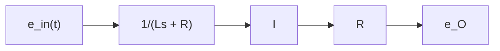

# Example 6.3

Consider again the simple RL circuit from Example 6.1 and Fig. 6.1. Using Simulink, build a simulation of this system and determine the current I(t) and the resistor voltage $e _ { O } ( t )$ if the voltage input $e _ { \mathrm { i n } } ( t )$ is a 2-V step function applied at time t = 0. The current is initially zero, and $L = 0 . 1$ 1 H and $R = 1 . 6 \Omega$ .

We need to construct a block diagram of this system and a transfer function is probably the easiest way to represent this simple first-order model (the reader should note that this system has zero initial conditions and hence we may use a transfer function). The transfer function was derived in Example 6.1 and it is repeated below

$$\frac {1}{L s + R} = \frac {I (s)}{E _ {\mathrm{in}} (s)} \tag {6.11}$$

Figure 6.5 shows the I/O relationship between source voltage $e _ { \mathrm { i n } } ( t )$ and current I. Because we want $e _ { O } = R I$ as the output variable, we multiply current I by resistance R as shown in Fig. 6.5. We construct our Simulink model using the block diagram in Fig. 6.5, which consists of a single transfer function for the RL circuit dynamics, Eq. (6.11), followed by a gain block (resistance R) that produces the desired output signal $e _ { O }$ .

flowchart

Figure 6.5 Block diagram for Example 6.3.
