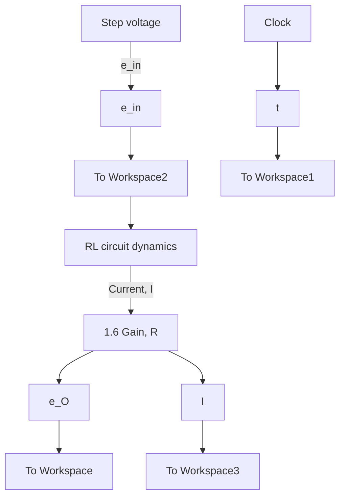

We set the desired system parameters (input voltage $e _ { \mathrm { i n } } = 2 \mathrm { V }$ , inductance L = 0.1 H, and resistance $R = 1 . 6 \Omega )$ by double-clicking on the appropriate Step, Transfer Fcn, and Gain blocks and entering the numerical values. The transfer function block has two dialog boxes for the numerator and denominator coefficients, which are entered as row vectors in descending powers of s. Note that Simulink displays the numerical values in the Transfer Fcn and Gain blocks once they have been set. The fixed-step, fourth-order Runge–Kutta method ode4 is selected as the numerical solver under the Simulation > Model Configuration Parameters menu, and the fixed time step is set at $1 0 ^ { - 3 } :$ s. Labels for blocks and signal paths may be added for clarity. Figure 6.6 shows the final Simulink model, which essentially matches the block diagram in Fig. 6.5.

It should be emphasized that Simulink uses the transfer function block in Fig. 6.6 to represent the I/O equation of the RL circuit dynamics, and even though the transfer function includes the complex Laplace variable s, Simulink determines the system response by using MATLAB’s numerical integration algorithms and not by using Laplace transform theory. Hence, it is correct to use the time-domain labels, such as $e _ { O } ( t )$ , on the signal paths and not the Laplace-transformed variables, such as $E _ { O } ( s )$ ).

After the Simulink model is constructed and all parameters are set, the simulation is executed by selecting Simulation > Run (or, by clicking the Run button). Plots of the stored variables I and ${ \tt e } \_ { 0 }$ can be created using MATLAB’s plot command. Figure 6.7 presents plots of current I(t) and resistor voltage $e _ { O } ( t )$ vs. time. Note that both step responses are identical to the unit-step responses (Fig. 6.2 from Example 6.1) if we apply a scaling factor of 2. This comparison makes sense for linear systems because the input here is a 2-V step whereas the source voltage in Example 6.1 was a unit-step input.

flowchart

