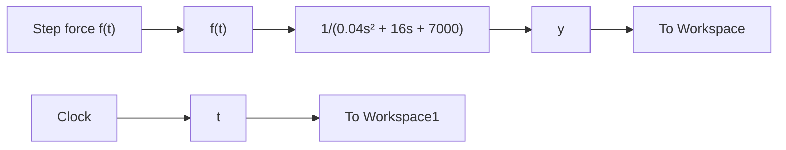

# Example 6.4

Consider again the three-way spool-valve system described in Example 6.2 (Fig. 6.3). Simulate the system response using Simulink with a transfer-function representation. The applied force f (t) is a step function with a magnitude of 12 N.

In Example 6.2 we derived the transfer function that relates spool-valve position y(t) to actuator force f (t):

$$\frac {1}{0 . 0 4 s ^ {2} + 1 6 s + 7 0 0 0} = \frac {Y (s)}{F (s)} \tag {6.12}$$

We construct our Simulink diagram by using the Transfer Fcn block from the Continuous library, the Clock and Step blocks from the Sources library, and the To Workspace blocks from the Sinks library. Double-clicking the Transfer Fcn block opens a dialog box, where we can enter the numerator and denominator coefficients of the desired transfer function in Eq. (6.12). The parameters governing the force input are also set by double-clicking the Step block: step time is 0.02 s, initial value is 0 N, and final value is 12 N. Finally, we choose the fixed-step, Runge–Kutta numerical integration algorithm ode4 (with step size of $1 0 ^ { - 4 } ~ \mathrm { s } )$ under the Simulation > Model Configuration Parameters menu. Figure 6.8 presents the Simulink diagram of the spool valve using the transfer-function approach. Figure 6.9 presents the response of the spool-valve position y(t) to the 12-N step input force. Note that y(t) begins at zero (its initial condition), responds to the step force applied at t = 0.02 s, reaches a peak response of about 0.002 m (2 mm), and settles to its final constant value of 0.0017 m (1.7 mm). The step response shown in Fig. 6.9 is identical to the 12-N pulse response from Example 6.2 until $t = 0 . 0 6 \mathrm { s } :$ at which time the pulse input steps to zero (see Fig. 6.4).

flowchart

Figure 6.8 Simulink diagram for Example 6.4: transfer-function approach.

line

| Time, s | Spool-valve position, y(t), m (×10⁻³) |
| --- | --- |
| 0.00 | 0.000 |
| 0.02 | 0.000 |
| 0.03 | 2.0 |
| 0.04 | 1.7 |
| 0.06 | 1.7 |
| 0.08 | 1.7 |
| 0.10 | 1.7 |

Figure 6.9 Spool-valve response to a 12-N step force (Example 6.4).
