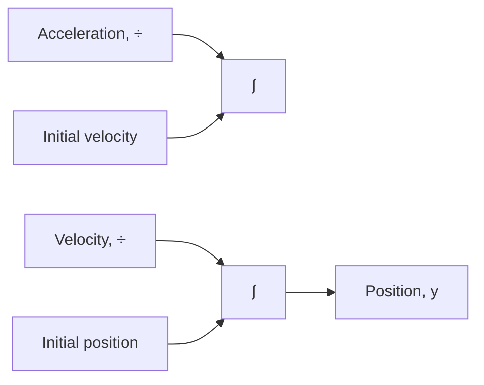
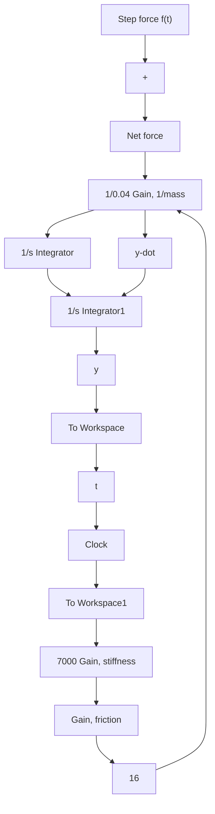

# Example 6.6

Given the three-way spool-valve system in Fig. 6.3 and Example 6.2, create and execute a simulation using the integrator-block approach. The applied force f (t) is a 12-N step function.

The basic concept of the integrator-block approach is to simply “chain together” a series of n integrator blocks for each nth-order I/O equation. For this example, we have a single second-order I/O equation, and therefore the “core” of the simulation will be two successive integrals of acceleration, as shown in Fig. 6.11. Note that each integrator block has an initial condition (the integration constant) that is added to the time integral of the input signal.

In order to use the integrator-block method, we start with an expression for the nth-order derivative term (acceleration in this case), which we obtain from Eq. (6.8)

$$\ddot {y} = \frac {1}{0 . 0 4} (- 1 6 \dot {y} - 7 0 0 0 y + f (t)) \tag {6.19}$$

Therefore, the left-hand side of the block diagram in Fig. 6.11 (acceleration) must be equal to the right-hand side of Eq. (6.19), which is the sum of the friction, stiffness, and applied forces divided by mass.

flowchart

Figure 6.11 Block diagram of two successive integrals of acceleration.

flowchart

Figure 6.12 Simulink diagram for Example 6.6: integrator-block approach.
