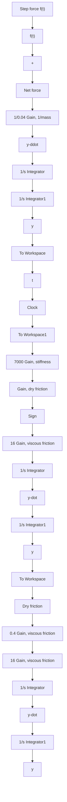

Figure 6.13 Simulink diagram for Example 6.7: nonlinear mechanical system with integrator-block approach.

Figure 6.14 presents the response of the nonlinear spool-valve system to the 12-N step input force applied at time $t = 0 . 0 2 { \mathrm { s } }$ . The solid line in Fig. 6.14 is the step response of the nonlinear system with dry friction, and the dashed line is the step response of the linear system from Example 6.2 (no dry friction). Note that the inclusion of nonlinear dry friction slightly reduces the peak response of y(t) as compared to the peak response of the linear model. In addition, the nonlinear response does not exhibit “undershoot” after the peak response, but rather reaches its constant value at about 0.035 s (the linear response reaches its constant value after 0.04 s).

Modeling Coulomb or dry friction using the signum function can at times cause simulation problems because of its discontinuity at zero velocity. The discontinuity often requires a small integration step size so that the force is accurately computed near zero velocity, which in turn slows down the simulation run time. Furthermore, the signum function can lead to “chatter” where the dry friction force rapidly switches signs between $\pm F _ { \mathrm { d r y } }$ because of the velocity signal switching signs as it approaches zero (equilibrium). For these reasons, it may be useful to approximate the discontinuous dry friction $F _ { \mathrm { d r y } } \operatorname { s g n } ( \dot { y } )$ force with the following continuous function

$$F _ {\mathrm{DF}} = \frac {F _ {\mathrm{dry}} \dot {y}}{\sqrt {\dot {y} ^ {2} + \varepsilon^ {2}}} \tag {6.22}$$
