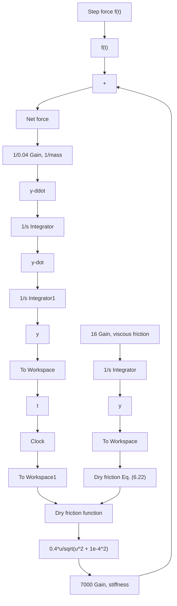

We can modify the nonlinear Simulink diagram shown in Fig. 6.13 and use the continuous equation (6.22) to model dry friction force. Figure 6.16 shows the Simulink diagram of the spool valve with the continuous dry friction force model. In this case, we have defined the dry friction force with the Fcn (or function) block from the User-Defined Functions library. The Fcn block allows the user to define any functional output equation in terms of a single input (u). To do so, the user must double-click the Fcn block and enter the desired equation in the Expression dialog box. Figure 6.16 shows Eq. (6.22) in the function block, where u is the generic symbol that represents the input to the block (velocity, ẏ , in this case). Note that the constant ?? is set to $1 0 ^ { - 4 }$ m/s. Executing the Simulink diagram in Fig. 6.16 produces a response for valve position y(t) that is essentially identical to the response shown in Fig. 6.14 for the nonlinear Simulink diagram that uses the discontinuous signum function for the dry friction force.

flowchart

Figure 6.16 Simulink diagram for Example 6.7: nonlinear mechanical system with continuous function for dry friction.
