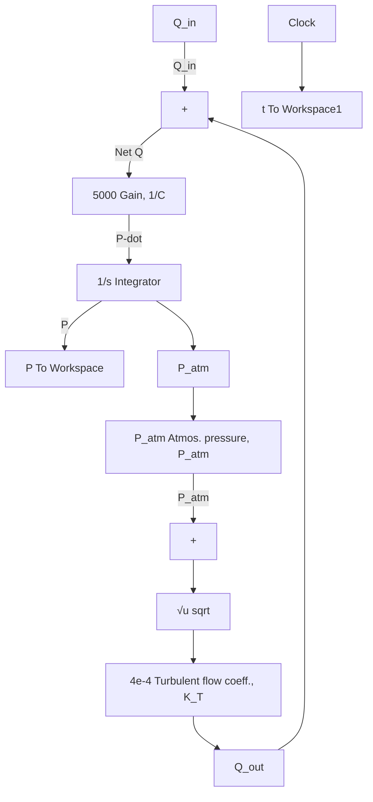

Figure 6.18 presents the Simulink diagram of the nonlinear tank model. The system input, $Q _ { \mathrm { i n } } ,$ , is represented by the Constant block from the Sources library. In this example, the variable name Q\_in has been entered in the dialog box for the Constant block instead of a particular numerical value. In a similar fashion, a Constant block is used to define atmospheric pressure P\_atm, which is subtracted from the tank pressure P to form the pressure difference. Therefore, the user must define the constants Q\_in and P\_atm in the MAT-LAB workspace before executing the Simulink model. The nonlinear term in Eq. (6.24), the square root of the pressure difference, is clearly seen in Fig. 6.18. The pressure difference is computed using a summing junction, and the square-root operation is performed using the Sqrt block from the Math Operations library (note that in previous versions of MATLAB the square-root function resides in the Math Function block). The remainder of the Simulink diagram includes a summing junction to compute the net volumetric flow and a gain $( 1 / C = 5 0 0 0 \mathrm { P a } / \mathrm { m } ^ { 3 } )$ to produce the time-derivative of pressure, Ṗ . The reader should be able to see how the Simulink diagram in Fig. 6.18 matches the governing nonlinear model (Eq. 6.24).


<details>
<summary>flowchart</summary>


</details>

Figure 6.18 Simulink diagram for Example 6.8: nonlinear tank model.

MATLAB M-file 6.1   
```matlab
%
% run_tank_NL.m
%
% This M-file sets the parameters for
% the hydraulic tank system, executes
% the nonlinear Simulink model, and
% plots the results
%
% tank system parameters
Q_in = 0.052;    % constant in-flow volumetric rate, m^3/s
P0 = 1.15e5;    % initial tank base pressure, N/m^2
P_atm = 1.0133e5;    % atmospheric pressure, N/m^2

% execute nonlinear Simulink model
sim tank_NL

% plot the tank pressure
plot(t,P)
grid
title('Nonlinear model: tank pressure vs. time')
xlabel('Time, s')
ylabel('Tank pressure, P(t), N/m^2') 
```
