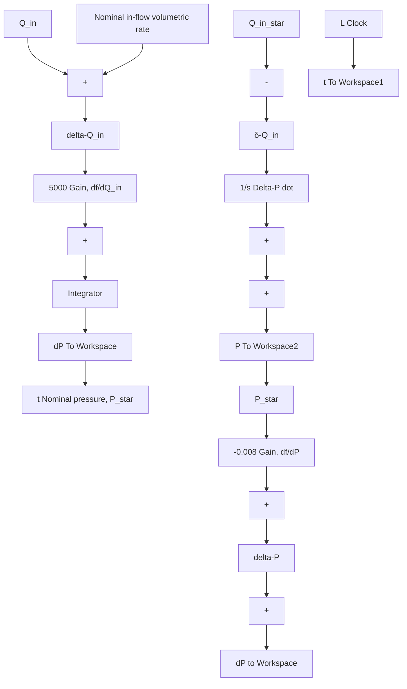

We may now run both the nonlinear and linear models and compare the responses. As previously shown, the nominal input volumetric-flow rate is $Q _ { \mathrm { i n } } ^ { * } = 0 . 0 5 \mathrm { m } ^ { 3 } / \mathrm { s }$ , and the corresponding nominal pressure is $P ^ { * } = 1 . 1 6 9 5 5 ( 1 0 ^ { 5 } ) \mathrm { N } / \mathrm { m } ^ { 2 }$ . The actual input flow rate is set to $Q _ { \mathrm { i n } } = 0 . 0 5 2 \mathrm { m } ^ { 3 } / \mathrm { s }$ , and the initial tank pressure is set at $P _ { 0 } = 1 . 1 5 ( 1 0 ^ { 5 } ) \mathrm { N } / \mathrm { m } ^ { 2 }$ , which is less than the nominal pressure. Therefore, the (constant) perturbation flow rate is $\delta Q _ { \mathrm { i n } } = 0 . 0 0 2 \ : \mathrm { m } ^ { 3 } / \mathrm { s }$ and the initial perturbation pressure is $\delta P _ { 0 } = - 1 9 5 5 \mathrm { N } / \mathrm { m } ^ { 2 }$ . Figure 6.20 presents the tank pressure responses from the nonlinear and linear Simulink models. The linear solution accurately matches the true nonlinear solution for tank pressure and underestimates the final (steady) pressure by less than $2 5 \mathrm { N } / \mathrm { m } ^ { 2 }$ . The linear solution is accurate because the perturbations are relatively small: the flow-rate perturbation is within 4% of its nominal value, while the initial pressure perturbation is less than 2% of its nominal value.

flowchart

Figure 6.19 Simulink diagram for Example 6.8: linear tank model.
