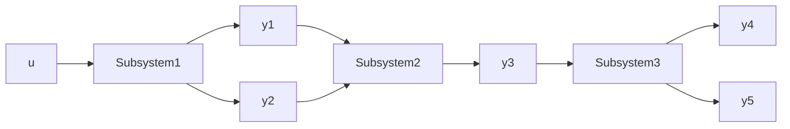

Simulink has two methods for constructing subsystem blocks: (1) using the Subsystem block from the Ports & Subsystems library and (2) grouping an existing Simulink diagram into a subsystem. For the first method, the user drags and drops the Subsystem icon from the Ports & Subsystems library to the workspace, double-clicks on the subsystem block, and then constructs the subsystem model using the typical Simulink blocks (integrators, gains, summing junctions, etc.). The default Subsystem block has one input and one output, and the user can add inputs and outputs by selecting the In1 and Out1 icons from the Ports & Subsystems library. The second method involves constructing the subsystem model first (such as Fig. 6.12) and then selecting the desired blocks and connecting signal paths with a bounding box (click and hold outside of the block diagram, drag the cursor across the diagram, release the mouse button). When the desired blocks and signal paths are selected, use the Diagram menu to select Subsystem & Model Reference > Create Subsystem from Selection to construct a subsystem. The user can open the subsystem to see and edit the inner model by double-clicking the subsystem block.

Building an integrated system using Simulink is best demonstrated by an example. The following example presents the electromechanical solenoid previously described in Chapters 2, 3, and 5.

flowchart

Figure 6.21 Functional block diagram of an integrated system.
