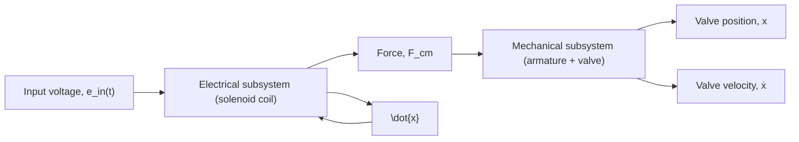

Next, we construct each subsystem model, just as we constructed Simulink block diagrams in the previous examples. Figure 6.24 presents the electrical subsystem model, which matches the mathematical modeling equation (6.29). Note that the gain blocks do not contain numerical values but rather use variable names (R, L, and K) that are set to the respective numerical parameters in the MATLAB workspace before executing the simulation. The simulation diagram shows that the input voltage $e _ { \mathrm { i n } } ( t )$ , resistor voltage RI, and back-emf voltage KIẋ are summed together (with the proper signs) and divided by inductance L to produce the time-rate of current, ̇I, which is integrated to produce current I. The electromagnetic force $F _ { \mathrm { e m } }$ is computed by squaring current I and multiplying by K/2; see Eq. (6.31). Note that current and force are saved to the workspace so that they may be plotted after the simulation is executed. The two inputs, $e _ { \mathrm { i n } } ( t )$ and ẋ , are designated by the In1 and In2 input port icons from the Ports & Subsystems library (they are relabeled as e\_in and xdot), and the single output $F _ { \mathrm { e m } }$ is designated by the Out1 output port icon, also from the Ports & Subsystems library (relabeled as F\_em). After the block diagram of the electrical system in Fig. 6.24 is completed, it is enclosed into a group and the corresponding subsystem block shown in Fig. 6.25 is created using the method previously described. Doubleclicking the subsystem block in Fig. 6.25 will open the subsystem and display the detailed block diagram of the electrical model shown in Fig. 6.24.

flowchart

Figure 6.23 Functional block diagram for the solenoid actuator (Example 6.9).

flowchart

