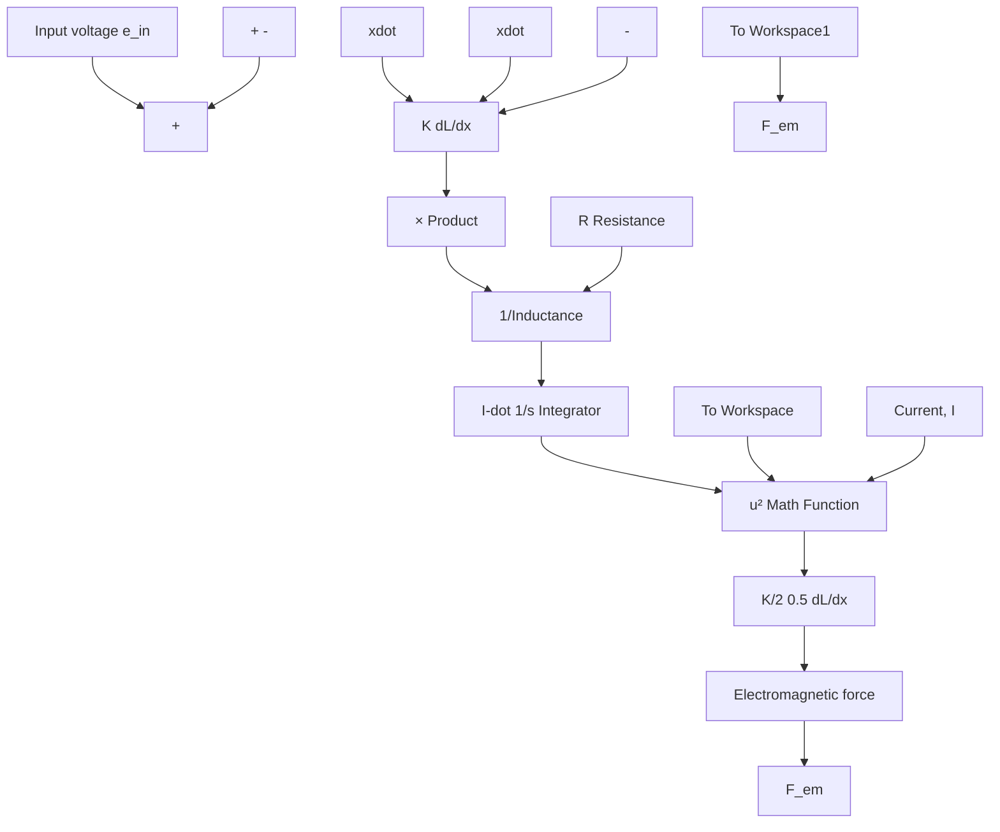
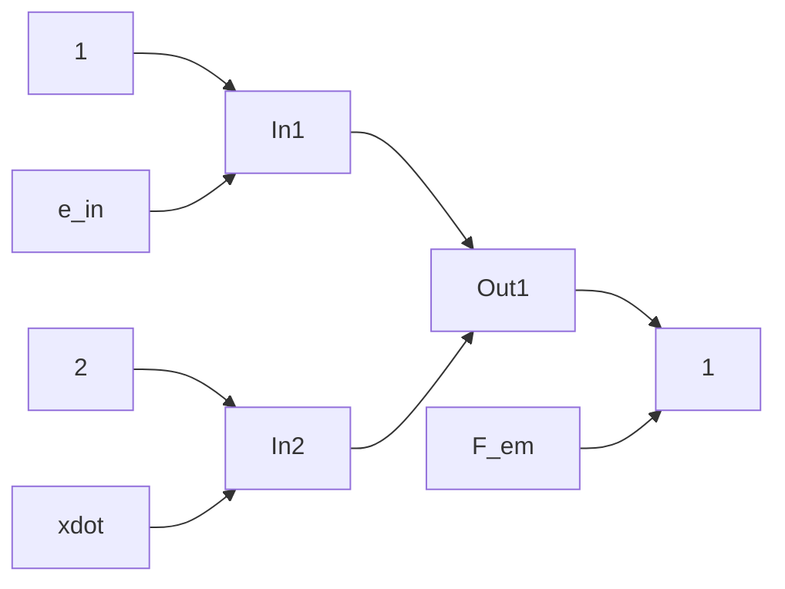

Figure 6.24 Simulink diagram for Example 6.9: electrical subsystem.

The same procedure is applied to the mechanical modeling equation (6.30). Figure 6.26 presents the mechanical subsystem model, which also uses variables in the gain blocks (such as 1/m, b, k, and F\_dry) instead of fixed numerical values. The electromagnetic force (the single input variable), friction forces, and return-spring force are summed together to create the net force. The net force is divided by mass m and then integrated (twice) to produce velocity and position, which are the two output variables of the subsystem. The signum (or Sign) function from the Math Operations library operates on velocity in order to compute the dry friction force. After the mechanical system in Fig. 6.26 is completed, the corresponding subsystem block shown in Fig. 6.27 is created. Double-clicking the subsystem block in Fig. 6.27 will open and display the detailed block diagram of the mechanical model shown in Fig. 6.26.

The integrated electromechanical system is constructed by properly connecting the electrical and mechanical Simulink subsystems (Figs. 6.25 and 6.27), and Fig. 6.28 presents the complete Simulink model (because the input and output ports have been labeled inside each subsystem these labels appear in Fig. 6.28). Note that the Simulink model in Fig. 6.28 matches the functional block diagram shown in Fig. 6.23. A Step block is used to produce the 10-V input $e _ { \mathrm { i n } } ( t )$ , and the input block is modified so that the step occurs at time t = 0.05 s.

flowchart

Figure 6.25 Simulink subsystem for Example 6.9: electrical subsystem.

