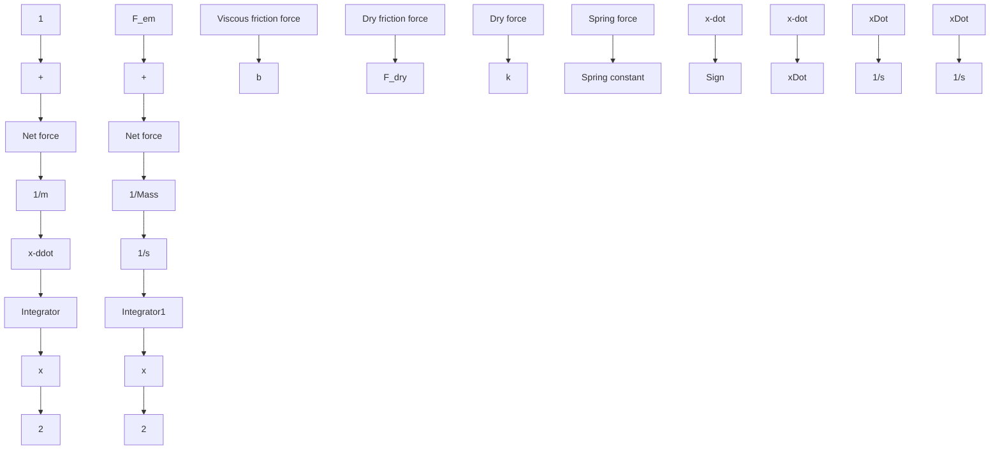
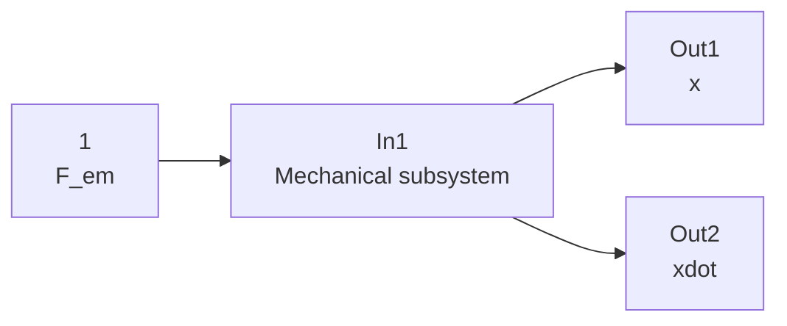
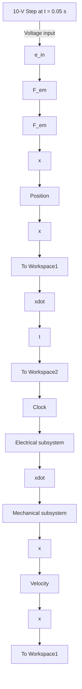

flowchart

Figure 6.26 Simulink diagram for Example 6.9: mechanical subsystem.

flowchart

Figure 6.27 Simulink subsystem for Example 6.9: mechanical subsystem.

flowchart

Figure 6.28 Simulink diagram for Example 6.9: integrated solenoid actuator system.

We can now simulate the integrated system. Table 6.1 presents the numerical values of the system parameters for the solenoid actuator. All integrators in the subsystem models are initialized with values of zero. MATLAB M-file 6.3 sets the required parameters and executes the Simulink model integrated\_EMA.mdl (Fig. 6.28) using the sim command (note that “EMA” denotes “electromagnetic actuator”). This M-file also plots the desired dynamic variables, current I(t) and armature–valve position x(t) (note that the M-file converts position to units of millimeters for the plot).

Table 6.1 System Parameters for the Solenoid Actuator (Example 6.9)
