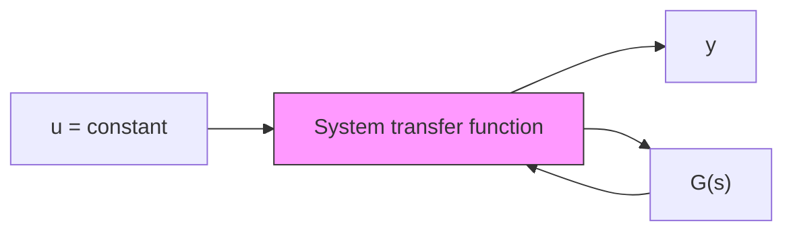
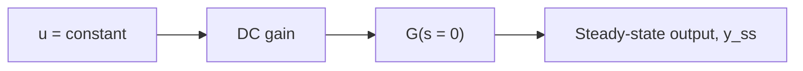

# DC Gain

The DC gain is a useful analysis technique for computing a system’s steady-state response to a constant input. The name arises from circuit analysis, where “direct current” or DC implies a constant, nonoscillatory input, as opposed to “alternating current” or AC. The definition of the system DC gain is the steady-state gain to a constant input, for the case when the output reaches a constant steady-state value. The DC gain can be computed from the system’s transfer function by setting the complex variable s = 0, which is a consequence of the final-value theorem in Laplace transform theory (see Section 8.2 for details). However, we can show the concept of the DC gain using the differential or D operator method instead of using Laplace transforms.

For example, consider the third-order, linear I/O equation

$$a _ {3} \ddot {y} + a _ {2} \ddot {y} + a _ {1} \dot {y} + a _ {0} y = b _ {1} \dot {u} + b _ {0} u \tag {7.21}$$

If the input u(t) is a constant, and if the output y(t) reaches a constant steady-state value, then all derivative terms of the input and output variables go to zero at steady state, that is, when t → ∞. In the case of constant input (u̇ = 0) and constant output at steady state $( { \mathfrak { y } } ( \infty ) = { \mathfrak { y } } ( \infty ) = { \mathfrak { y } } ( \infty ) = 0 )$ , we can easily solve Eq. (7.21) for the steady-state output

$$y _ {\mathrm{ss}} = \frac {b _ {0}}{a _ {0}} u \tag {7.22}$$

The ratio $b _ { 0 } / a _ { 0 }$ in Eq. (7.22) acts as a constant gain at steady state, and thus it is the DC gain for this case.

We can show the same result using the D operator method, which we apply to the I/O equation (7.21) to obtain the ratio of output to input

$$\frac {y (t)}{u (t)} = \frac {b _ {1} D + b _ {0}}{a _ {3} D ^ {3} + a _ {2} D ^ {2} + a _ {1} D + a _ {0}} \tag {7.23}$$

flowchart

flowchart

(b)   
Figure 7.3 SISO system: (a) system transfer function and (b) system gain at steady state (DC gain).
