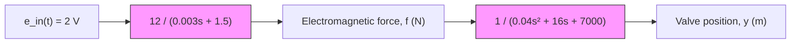

# Example 7.4

Figure 7.4 presents the block diagram of a simplified solenoid actuator–valve system (the spool valve is shown in Fig. 7.2). If the input voltage $e _ { \mathrm { i n } } ( t )$ is a constant 2 V, determine the steady-state electromagnetic force $f _ { \mathrm { s s } }$ and steady-state valve position $y _ { \mathrm { s s } }$ .

In Chapter 3 we developed a complex model of the solenoid actuator that involved a nonlinear relationship between current and electromagnetic force and armature motion and induced voltage (the “back emf”). In this example, we use a linear current-force relationship and neglect the motion-induced voltage, and hence the electromagnetic force can be modeled as the response of a first-order system (an RL coil circuit) to an applied voltage, as shown in Fig. 7.4. The spool valve is composed of a single mass with a return spring and viscous friction. Its transfer function in Fig. 7.4 is therefore second-order and linear. The solenoid is modeled by a first-order transfer function with source voltage $e _ { \mathrm { i n } } ( t )$ as the input and force f as the output, while the spool valve is modeled by a second-order transfer function with force f as the input and valve position y as the output.

The DC gain of the solenoid transfer function is obtained by setting s = 0, which results in a gain of $1 2 / 1 . 5 = 8 $ . Therefore, the steady-state force is $f _ { \mathrm { s s } } = 2 \mathrm { V } \cdot 8 = 1 6 \mathrm { N }$ . The DC gain of the spool-valve transfer function is also obtained by setting s = 0, which results in a gain of $1 / 7 0 0 0 = \bar { 1 } . 4 2 8 6 ( 1 0 ^ { - 4 } )$ . The steady-state valve position is computed using the steady-state force $f _ { \mathrm { s s } }$ as the constant input to the spool-valve transfer function, which yields $y _ { \mathrm { s s } } = 1 6 \mathrm { N } \cdot 1 . 4 2 8 6 ( 1 0 ^ { - 4 } ) = 0 . 0 0 2 3 \mathrm { m }$ , or 2.3 mm.

flowchart

Figure 7.4 Solenoid actuator and spool valve for Example 7.4.

The steady-state valve position can also be obtained by multiplying the solenoid and spool-valve transfer functions to obtain a single transfer function relating input voltage $e _ { \mathrm { i n } } ( t )$ to valve position y:

$$\frac {1 2}{(0 . 0 0 3 s + 1 . 5) (0 . 0 4 s ^ {2} + 1 6 s + 7 0 0 0)} = \frac {Y (s)}{E _ {\mathrm{in}} (s)}$$

The DC gain of this total transfer function is $1 2 / ( 1 . 5 \cdot 7 0 0 0 ) = 0 . 0 0 1 1 4 3$ , and therefore the steady-state valve position is $y _ { \mathrm { s s } } = 2 \mathrm { V } \cdot 0 . 0 0 1 1 4 3 = 0 . 0 0 2 2 8 6 \mathrm { m }$ , or 2.3 mm, as before.
