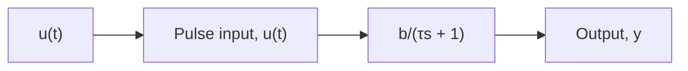

# Pulse Response of a First-Order System

Recall that a pulse input consists of a constant input that lasts for a finite duration, and then instantly steps to zero. Therefore, a pulse input with magnitude P can be described as

$$
u (t) = \left\{ \begin{array}{l l} 0 & \text { for } \quad t \leq 0 \\ P & \text { for } \quad 0 <   t <   T \\ 0 & \text { for } \quad t \geq T \end{array} \right. \tag {7.37}
$$

Figure 7.7 shows a first-order system with a pulse input of magnitude P, where we have used the standard form Eq. (7.25) for the first-order transfer function (because we are using a transfer function to depict the system, the initial output y(0) is zero). Before we obtain the mathematical solution of the pulse response, we can use the previous results for the zero-input and step-input cases to characterize the output. If the pulse duration T is greater than the settling time of the first-order system, that is, $T > 4 \tau$ , then the initial part of the pulse response will simply “look” like a step response, and the output will initially exhibit an exponential rise to a steady value. When the pulse input is stepped to zero at $t = T$ , the latter part of the pulse response $( \mathrm { i } . \mathrm { e } . , t > T )$ will “look” like the free response shown in Fig. 7.5, and the output will eventually decay to zero in four time constants.

flowchart

Figure 7.7 First-order system with pulse input.   

line

| t | y(t) |
| --- | --- |
| 0 | 0 |
| 4τ | Pb |
| T | Pb |
| T + 4τ | 0 |

Figure 7.8 Pulse response of a first-order system where pulse time $T > 4 \tau$ .

Figure 7.8 shows the pulse response of the first-order system where pulse time T is greater than the system’s settling time $t _ { S }$ . Note that the output y(t) exhibits an exponential rise from zero to a steady value, which it reaches in the settling time $t _ { S } = 4 \tau$ . The steady-state output is the product of the pulse magnitude P and the DC gain of the transfer function in Fig. 7.7, which is b. At time $t = T$ , the pulse is stepped to zero, and therefore the output y(t) shows an exponential decay to zero, which it reaches at approximately $t = T + 4 \tau$ .
