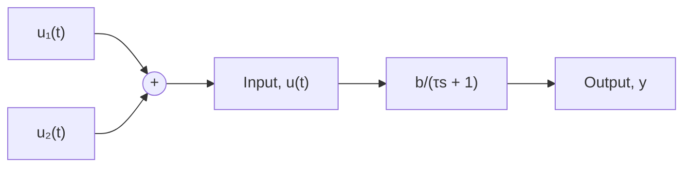

Next, we consider the case when the pulse duration is less than the system’s settling time. Figure 7.9 shows the pulse response of the first-order system where $T < 4 \tau$ , along with the step response to a constant input with magnitude P. The pulse response initially exhibits an exponential rise from zero as the pulse input is applied, thus matching the step response. However, at time $t = T$ the pulse response begins its decay to zero because the pulse input has vanished. The decay occurs before the response has reached its steady value because pulse time T is less than the system’s settling time $t _ { S } = 4 \tau$ . The pulse response for $t > T$ resembles the free response, and reaches zero in approximately four time constants after the pulse input goes to zero, or $t = T + 4 \tau$ as shown in Fig. 7.9.

We can compute the pulse response by applying the superposition property, which states that the system response to two or more simultaneous input functions is equivalent to the sum of the individual responses to the individual inputs. As we noted in Chapter 1, linear systems obey the superposition property. Figure 7.10 shows two equivalent simulation diagrams demonstrating the superposition property for our standard firstorder system with input $u ( t ) = u _ { 1 } ( t ) + u _ { 2 } ( t )$ . We can synthesize the pulse input described by Eq. (7.37) by adding a step function with magnitude $P$ to a second step function with magnitude −P and step time $t = T$ . Mathematically, the two input functions are

$$u _ {1} (t) = P U (t)u _ {2} (t) = - P U (t - T) \tag {7.38}$$

line

| t | Pulse response | Step response |
| --- | --- | --- |
| 0 | 0 | 0 |
| T | Peak | ~0.8 |
| T + 4τ | Decreasing | ~1.0 |

Figure 7.9 Pulse response of a first-order system where pulse time $T < 4 \tau .$

flowchart

(a)

flowchart

