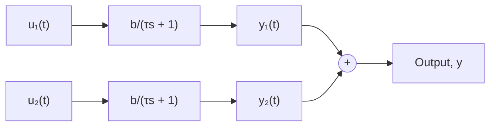

(b)   
Figure 7.10 Equivalent simulation diagrams of a first-order system with two input functions.

Note that $U ( t { - } T )$ is a “delayed” unit-step function; that is, it is zero when $t \leq T$ , and unity when $t > T$ . Using the simulation diagram shown in Fig. 7.10b, each output will be a step response, and therefore we can use the step-response Eq. (7.34) to write equations for each component of the pulse response

$$
y _ {1} (t) = P b \left(1 - e ^ {- t / \tau}\right) \tag {7.39}
y _ {2} (t) = \left\{ \begin{array}{c c} 0 & \text { for } 0 \leq t \leq T \\ - P b \left(1 - e ^ {- (t - T) / \tau}\right) & \text { for } t > T \end{array} \right. \tag {7.40}
$$

The second output $y _ { 2 } ( t )$ must be zero for $t \leq T$ as its input in Fig. 7.10b is a delayed step function. Another way to write Eq. (7.40) is to use the delayed unit-step function to replace the discontinuity at $t = T$

$$y _ {2} (t) = - P b \left(1 - e ^ {- (t - T) / \tau}\right) U (t - T) \tag {7.41}$$

The pulse response y(t) is the sum of $y _ { 1 } ( t )$ and $y _ { 2 } ( t )$

$$y (t) = P b \left(1 - e ^ {- t / \tau}\right) - P b \left(1 - e ^ {- (t - T) / \tau}\right) U (t - T) \tag {7.42}$$

which is a mathematical representation of the pulse responses shown in Figs. 7.8 and 7.9.

The important feature of this pulse-response example is not the form of the output equation (7.42), but rather the understanding that the response of a linear system to an arbitrary input function u(t) (such as a pulse) can be found by summing the individual responses to potentially simpler input functions (such as step functions) that constitute u(t). The reader should be able to sketch the pulse response of a first-order system by noting the magnitude of the pulse and the relationship between the time constant ?? and the pulse duration T.
