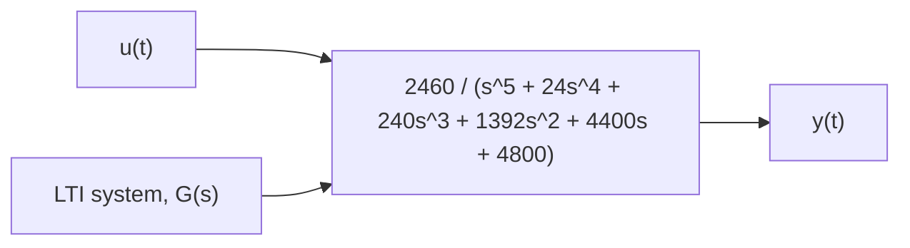

# Example 7.9

Given the linear system shown in Fig. 7.23, determine the characteristics of the natural response $y _ { H } ( t )$ and estimate its time to reach steady state if the input u(t) is a unit-step function.

The natural response is dictated by the characteristic roots, which are equivalent to the poles of the transfer function G(s). The poles of G(s) satisfy

$$s ^ {5} + 2 4 s ^ {4} + 2 4 0 s ^ {3} + 1 3 9 2 s ^ {2} + 4 4 0 0 s + 4 8 0 0 = 0$$

which can be solved using the MATLAB roots command

$$> > \text { roots } ([ 1 2 4 2 4 0 1 3 9 2 4 4 0 0 4 8 0 0 ])$$

Using this command, we find that the five poles (or, characteristic roots $r _ { i } )$ are $r _ { 1 } = - 2 , r _ { 2 } = - 6 , r _ { 3 } = - 1 0$ , and $r _ { 4 , 5 } = - 3 \pm j 5 . 5 6 7 8$ . Therefore, the natural response has the form

$$y _ {H} (t) = c _ {1} e ^ {- 2 t} + c _ {2} e ^ {- 6 t} + c _ {3} e ^ {- 1 0 t} + c _ {4} e ^ {- 3 t} \cos (5. 5 6 7 8 t + \phi)$$

Hence, the natural response is composed of three exponential functions (due to the three real roots), and a damped sinusoidal function (due to the two complex roots). The “fastest” part of the natural response is the exponential function $e ^ { - 1 0 t }$ because it reaches steady state in about 0.4 s. We see that the “slowest” part of $y _ { H } ( t )$ is the exponential function $e ^ { - 2 t }$ as it reaches steady state in about 2 s, and therefore the step response y(t) will reach its steady-state value in about 2 s. The reader should see that the steady-state response to a unit-step input is $y _ { \mathrm { s s } } = 0 . 5 1 2 5$ (use the system DC gain). Furthermore, because the natural response $y _ { H } ( t )$ dies out as time t → ∞ it is also the transient response.

flowchart

Figure 7.23 LTI system for Example 7.9.
