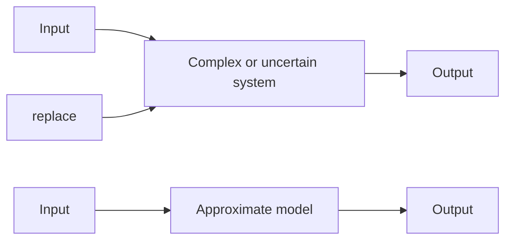

# 7.7 APPROXIMATE MODELS

Oftentimes during the preliminary design stage it is beneficial to use a simplified or approximate system model instead of the complete (more complex) higher-order model. For example, control system analysis and design can be performed using approximate subsystem models without significant loss of accuracy. The subsequent simulation run times can be greatly reduced by replacing higher-order, nonlinear, complex models with simplified, linear, reduced-order models. In other cases it is difficult to develop an accurate mathematical model from fundamental physical laws because of complex geometry, uncertain parameters (such as friction), or nonlinear effects (such as flow forces in fluid systems). If I/O data is available from conducting experiments with a physical system, then it may be possible to develop a simple model by “fitting” the measurements with a first- or second-order response.

In many cases, a properly designed first- or second-order model can adequately represent the full complex model. Figure 7.24 shows a schematic block diagram where the complex or uncertain system is replaced by an approximate model. It is important for the reader to understand that (1) not every complex system can be accurately replaced by a simple approximate model, and (2) the original I/O relationship must be maintained by the approximate model.

This brief discussion alludes to the very important topic of model accuracy vs. model simplicity, which we discussed in Chapter 1. The engineer must always remember that a compromise exists between modeling effort and computational time and model accuracy. In some applications, leaving out the higher-order and/or nonlinear terms may not degrade the accuracy of the simplified model; in some cases including the complex dynamics is critical. Engineering experience is extremely important in making these decisions. The following example illustrates replacing a complex system with an approximate model.

flowchart

Figure 7.24 Replacing a complex or uncertain system with an approximate model.
