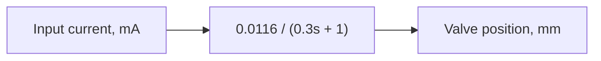

Figure 7.26 shows the first-order model that approximates the complex actuator–valve system. If we applied a 38-mA step input to the approximate model shown in Fig. 7.26, its response would look very much like the response from the experimental hydraulic test rig (Fig. 7.25). Figure 7.27 shows the first-order response of the approximate model plotted with the measured valve response. The approximate model accurately predicts the settling time and steady-state response, but it exhibits some error with the measured valve position during the transient-response phase. An experienced engineer would need to determine if the first-order transfer function could be used to model the complex actuator–valve system based on factors such as accuracy requirements.

flowchart

Figure 7.26 First-order model that approximates the actuator–valve system (Example 7.11).

line

| Time, s | Measured valve response | Approximate valve response (1st-order model) |
| --- | --- | --- |
| 0 | 0.0 | 0.0 |
| 1 | 0.0 | 0.0 |
| 2 | 0.42 | 0.43 |
| 3 | 0.44 | 0.44 |
| 4 | 0.44 | 0.44 |
| 5 | 0.44 | 0.44 |
| 6 | 0.44 | 0.44 |

Figure 7.27 Step responses for the complex actuator–valve system and the first-order approximate model (Example 7.11).
