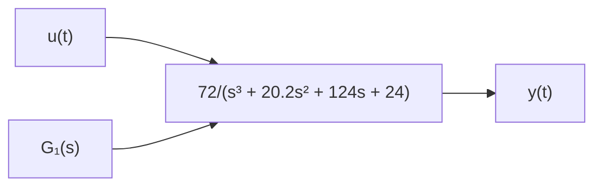
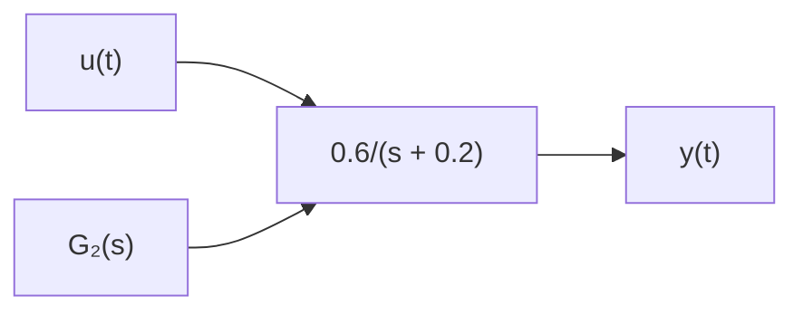

# 7.15 Figure P7.15 shows a linear third-order system and a linear first-order system. Analytically and numerically show that the first-order transfer function $G _ { 2 } ( s )$ is an excellent low-order approximate model of the thirdorder system $G _ { 1 } ( s )$ . Use MATLAB or Simulink for the numerical comparison.

flowchart

flowchart

Figure P7.15
