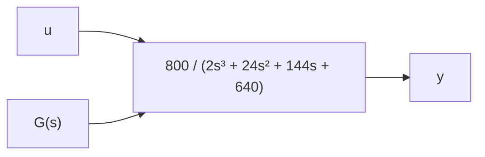

# 7.18 Given the SSR for a third-order system

$$
\dot {\mathbf {x}} = \left[ \begin{array}{c c c} 0 & 1 & 0 \\ 0 & 0 & 1 \\ - 3 4 0 & - 8 8 & - 9 \end{array} \right] \mathbf {x} + \left[ \begin{array}{c} 0 \\ 0 \\ 2 \end{array} \right] u \qquad y = \left[ \begin{array}{c c c} 1 & 0 & 0 \end{array} \right] \mathbf {x}
$$

a. Use MATLAB to determine the eigenvalues.   
b. Describe the free response of the output y(t) given an arbitrary initial state $\mathbf { x } ( 0 )$ ).   
c. Use MATLAB or Simulink to verify your answer in part (b). The initial state vector is $\mathbf { x } ( 0 ) = [ x _ { 1 } ( 0 ) \ x _ { 2 } ( 0 ) \ x _ { 3 } ( 0 ) ] ^ { T } = \left[ - 4 \quad 0 \quad 0 \right] ^ { T }$ .

7.19 Figure P7.19 shows a mass–damper system (no stiffness, see Problem 2.3). Displacement x is measured from an at-rest position where the damper is at the “neutral” position. The external force $f _ { a } ( t )$ is a shortduration pulse function: $f _ { a } ( t ) = 5 \mathrm { N }$ for $0 \leq t \leq 0 . 0 2 \mathrm { s }$ , and $f _ { a } ( t ) = 0$ for $t > 0 . 0 2 { \mathrm { s } }$ . Therefore, force $f _ { a } ( t )$ can be modeled as an ideal impulsive input with the appropriate strength or weight. The system parameters are mass m = 0.5 kg and viscous friction coefficient $\bar { b } = \bar { 3 } \mathrm { N - s / m }$ and the system is initially at rest.

text_image

fₐ(t)
m
b
x

Figure P7.19

a. Determine the impulse response with velocity $\nu ( t ) = \dot { x } ( t )$ as the dynamic variable.   
b. Using the solution in part (a) compute the position response x(t) to the impulsive input force.   
c. Use MATLAB or Simulink to obtain a numerical solution and verify both answers in parts (a) and (b).

7.20 Figure P7.20 shows a system defined by a transfer function. Use MATLAB to determine the characteristic roots of the system. Describe the nature of the system’s transient response to a unit-step input, and consider issues such as the time to reach a steady-state response, and whether or not the transient response exhibits oscillations. Verify your answer with a numerical simulation using MATLAB or Simulink.

flowchart

Figure P7.20
