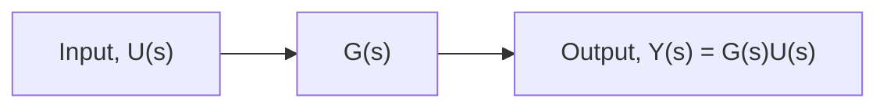

# Transfer-Function Analysis

Recall that we derived an expression for the system transfer function in Chapter 5 without using Laplacetransform theory (see Section 5.6). Let us now present the definition of the transfer function using Laplace methods: the transfer function G(s) is defined as the ratio of the Laplace transform of the output Y(s) to the Laplace transform of the input U(s) with zero initial conditions

$$\text { Transfer function: } \quad G (s) = \frac {Y (s)}{U (s)}$$

As a quick example, consider the I/O equation presented in Example 5.14

$$\ddot {y} + 8 \dot {y} + 1 0 y = 4 \dot {u} \tag {8.38}$$

Taking the Laplace transform of Eq. (8.38) yields

$$s ^ {2} Y (s) - s y (0) - \dot {y} (0) + 8 (s Y (s) - y (0)) + 1 0 Y (s) = 4 (s U (s) - u (0)) \tag {8.39}$$

Because the definition of the transfer function requires zero initial conditions, or $\dot { y } ( 0 ) = y ( 0 ) = u ( 0 ) = 0 .$ , Eq. (8.39) becomes

$$(s ^ {2} + 8 s + 1 0) Y (s) = 4 s U (s) \tag {8.40}$$

Forming the ratio of transformed output Y(s) to input U(s) yields the transfer function

$$G (s) = \frac {Y (s)}{U (s)} = \frac {4 s}{s ^ {2} + 8 s + 1 0} \tag {8.41}$$

Once we derive the transfer function, we can represent the system dynamics using the block diagram shown in Fig. 8.4. Note that the Laplace transform of the output is

$$Y (s) = G (s) U (s) \tag {8.42}$$

which can be derived from Eq. (8.41) or Fig. 8.4. The importance and usefulness of transfer-function analysis is encapsulated by noting the progression from the system I/O equation (8.38) to its transfer function Eq. (8.41) and ultimately a representation of the system output (Eq. (8.42) and Fig. 8.4).

The basic steps for using the transfer-function method to analytically obtain a system’s dynamic response are

1. Derive the system transfer function G(s) from the mathematical model (I/O equation).   
2. Multiply the transfer function G(s) by the Laplace transform of the given input function, U(s), to obtain the Laplace transform of the output Y(s).   
3. Take the inverse Laplace transform of Y(s) to obtain the time response of the output y(t).

It is important for the reader to remember that the transfer-function approach can be used only for LTI systems with zero initial conditions. The following examples illustrate transfer-function analysis.

flowchart

Dynamic system   
Figure 8.4 Transfer-function representation of a dynamic system.
