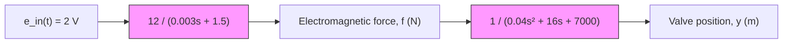

# Example 8.13

Figure 8.6 presents the block diagram of the simplified solenoid actuator–valve system from Example 7.4. If the input voltage $e _ { \mathrm { i n } } ( t )$ is a constant 2 V (step input for $t > 0 )$ , determine the response of the valve position y(t). The system is in equilibrium (i.e., zero initial conditions) at time $t = 0$ .

The two transfer functions in Fig. 8.6 are

Solenoid: $G _ { 1 } ( s ) = { \frac { 1 2 } { 0 . 0 0 3 s + 1 . 5 } } = { \frac { F ( s ) } { E _ { \mathrm { { i n } } } ( s ) } }$

$\mathrm { S p o o l ~ v a l v e : ~ } G _ { 2 } ( s ) = \frac { 1 } { 0 . 0 4 s ^ { 2 } + 1 6 s + 7 0 0 0 } = \frac { Y ( s ) } { F ( s ) }$

The overall system transfer function $G ( s )$ relating the valve position y (output) to the voltage $e _ { \mathrm { i n } } ( t )$ (input) can be obtained by multiplying the solenoid and spool-valve transfer functions

$$G (s) = G _ {1} (s) G _ {2} (s) = \frac {F (s)}{E _ {\mathrm{in}} (s)} \frac {Y (s)}{F (s)} = \frac {Y (s)}{E _ {\mathrm{in}} (s)}$$

Multiplying $G _ { 1 } ( s )$ and $G _ { 2 } ( s )$ yields

$$G (s) = \frac {1 2}{(0 . 0 0 3 s + 1 . 5) (0 . 0 4 s ^ {2} + 1 6 s + 7 0 0 0)} = \frac {Y (s)}{E _ {\mathrm{in}} (s)}$$

flowchart

Figure 8.6 Solenoid actuator and spool valve for Example 8.13.

or, equivalently

$$G (s) = \frac {1 0 0 , 0 0 0}{(s + 5 0 0) (s ^ {2} + 4 0 0 s + 1 7 5 , 0 0 0)} = \frac {Y (s)}{E _ {\mathrm{in}} (s)} \tag {8.51}$$

The Laplace transform of the position (output) is $Y ( s ) = G ( s ) E _ { \mathrm { i n } } ( s )$ , or

$$Y (s) = \frac {1 0 0 , 0 0 0}{(s + 5 0 0) (s ^ {2} + 4 0 0 s + 1 7 5 , 0 0 0)} E _ {\text { in }} (s) \tag {8.52}$$

Equations (8.51) and (8.52) are valid for any voltage input $e _ { \mathrm { i n } } ( t )$ . For a 2-V step input, the Laplace transform of the input is $E _ { \mathrm { i n } } ( s ) = 2 / s$ and Eq. (8.52) becomes

$$Y (s) = \frac {2 0 0 , 0 0 0}{s (s + 5 0 0) (s ^ {2} + 4 0 0 s + 1 7 5 , 0 0 0)} \tag {8.53}$$

The four poles of $Y ( s )$ are located at $s = 0 , s = - 5 0 0$ , and $s = - 2 0 0 \pm j 3 6 7 . 4 2$ . Note that we can “complete the square” and rewrite the second-order polynomial associated with the two complex poles as

$$s ^ {2} + 4 0 0 s + 1 7 5, 0 0 0 = (s + 2 0 0) ^ {2} + 3 6 7. 4 2 ^ {2}$$

Therefore, the partial-fraction expansion of Eq. (8.53) is
