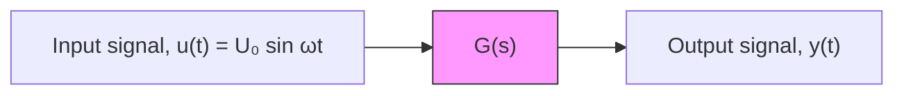

# 9.2 FREQUENCY RESPONSE

The objective of this section is to develop the general solution for a linear time-invariant (LTI) system that is being driven by a sinusoidal (or oscillating) input. Figure 9.1 shows the LTI system with the harmonic input $u ( t ) = U _ { 0 }$ sin ??t, where $U _ { 0 }$ is the magnitude (or amplitude) of the input sine function and ?? is the input frequency in rad/s (the reader should note that $U _ { 0 }$ is an amplitude and not the unit-step function $U ( t ) )$ ). Note that the harmonic input $u ( t )$ could also be a cosine function; however, the sine function may be more realistic as it begins at zero at time $t = 0$ as opposed to the cosine function. The reader should recall that any LTI system that is modeled by an input-output (I/O) differential equation can be represented by the corresponding transfer function G(s).

Recall that in Chapter 7 we showed that the complete (or total) solution of a linear differential equation has the general form

$$y (t) = y _ {H} (t) + y _ {P} (t) \tag {9.1}$$

where $y _ { H } ( t )$ and $y _ { P } ( t )$ are the homogeneous and particular solutions, respectively. In general, the form of the homogeneous (or natural) solution $y _ { H } ( t )$ depends on the characteristic roots of the I/O equation (or, the poles of the transfer function) while the form of the particular solution $y _ { P } ( t )$ depends on the nature of the input u(t). Furthermore, if all characteristic roots have negative real parts (i.e., they lie in the left-half of the complex plane) then the homogeneous response $y _ { H } ( t )$ will “die out” at steady state. As a quick example, consider the following third-order LTI system

$$\ddot {y} + 8 \ddot {y} + 3 7 \dot {y} + 5 0 y = u (t) \tag {9.2}$$

flowchart

Figure 9.1 Linear time-invariant (LTI) system with a sinusoidal input.

or, expressed as a transfer function

$$G (s) = \frac {1}{s ^ {3} + 8 s ^ {2} + 3 7 s + 5 0} = \frac {Y (s)}{U (s)} \tag {9.3}$$

The corresponding characteristic equation is

$$r ^ {3} + 8 r ^ {2} + 3 7 r + 5 0 = 0 \tag {9.4}$$

and the three characteristic roots are $r _ { 1 } = - 2$ and $r _ { 2 , 3 } = - 3 \pm j 4$ . We know from Chapter 7 that the general form of the homogeneous solution is
