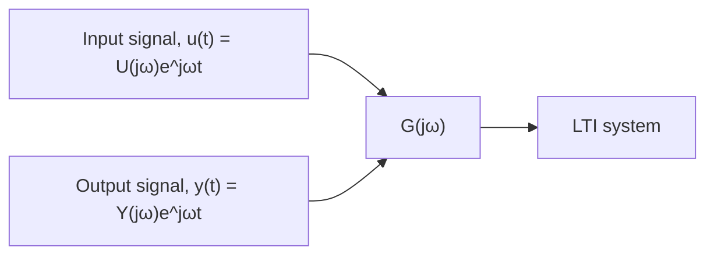

# Sinusoidal Transfer Function

In the previous subsection, we stated that the frequency response depends on the amplitude ratio $Y _ { 0 } / U _ { 0 }$ and phase angle $\phi$ and that these parameters are determined solely by the system transfer function G(s) and the input frequency ??. To demonstrate this fact, we introduce the sinusoidal transfer function. Recall that in Section 5.6 in Chapter 5 we considered the response of the following third-order I/O equation

$$a _ {3} \ddot {y} + a _ {2} \ddot {y} + a _ {1} \dot {y} + a _ {0} y = b _ {1} \dot {u} + b _ {0} u \tag {9.6}$$

The input is a real-valued exponential function, $u ( t ) = U ( s ) e ^ { s t }$ , where $s = \sigma + j \omega$ is a complex variable (with real part ?? and imaginary part ??) and $U ( s )$ is a complex function. In general, the exponential input function is

$$u (t) = U (s) e ^ {s t} = U (s) e ^ {\sigma t} e ^ {j \omega t} = U (s) e ^ {\sigma t} (\cos \omega t + j \sin \omega t) \tag {9.7}$$

where the last substitution comes from applying Euler’s formula $e ^ { j \theta } = \cos \theta + j \sin \theta$ . If the input $u ( t )$ is a harmonic (sinusoidal) function, then there is no exponential decay $e ^ { \sigma t }$ and the real part of s is zero, or $\sigma = 0$ . Rewriting Eq. (9.7) for a sinusoidal input with $s = j \omega$ we obtain

$$u (t) = U (j \omega) (\cos \omega t + j \sin \omega t) \tag {9.8}$$

Because the input $u ( t )$ is a real function, $U ( j \omega )$ is the complex conjugate of cos $\omega t + j$ sin ??t. Recall from Chapter 7 that if the input is $u ( t ) = U ( j \omega ) e ^ { j \omega t }$ the particular solution will also be an exponential function, $y ( t ) = Y ( j \omega ) e ^ { j \omega t }$ , where $Y ( j \omega )$ is a complex function. Next, substituting $u ( t ) = U ( j \omega ) e ^ { j \omega t }$ and $y ( t ) =$ $Y ( j \omega ) e ^ { j \omega t }$ into the system I/O equation (9.6) and noting that their time derivatives are

$$\dot {u} (t) = j \omega U (j \omega) e ^ {j \omega t}, \dot {y} (t) = j \omega Y (j \omega) e ^ {j \omega t}, \ddot {y} (t) = (j \omega) ^ {2} Y (j \omega) e ^ {j \omega t}, \mathrm{etc.}$$

flowchart

Figure 9.3 Sinusoidal transfer function and frequency response.
