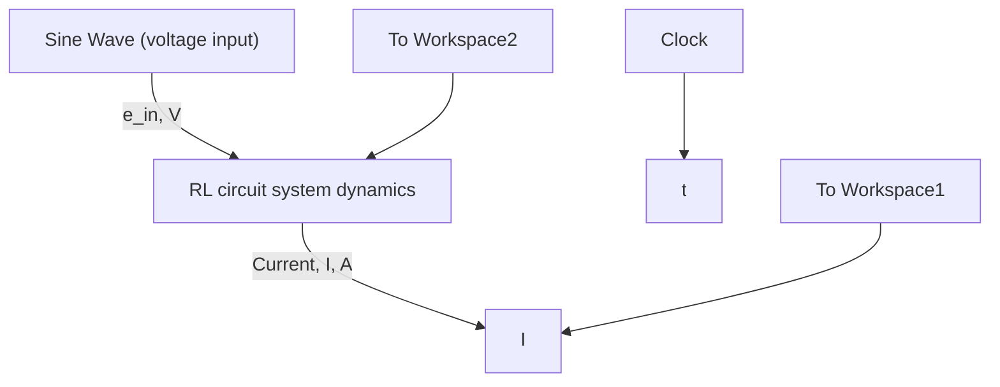

# Example 9.2

Use Simulink to simulate the RL circuit in Example 9.1 and plot the voltage input $e _ { \mathrm { i n } } ( t )$ and current response I(t) on the same graph.

Because the initial conditions are zero, we can use a transfer function to represent the system dynamics in Simulink. Figure 9.7 shows the Simulink block diagram of this very simple system. The Simulink model is constructed by connecting the Sine Wave from the Sources library to the Transfer Fcn block, which has been edited to match G(s) given in Eq. (9.20). The desired voltage input signal is created by editing the Sine Wave block and setting the Amplitude and Frequency dialog boxes to 2 (V) and 50 (rad/s), respectively.

Figure 9.8 shows the sinusoidal input voltage and the resulting current response from executing the Simulink model. The reader should note that the current begins at zero as prescribed in the problem statement. Because the RL circuit is a first-order LTI system we can compute its time constant ?? by dividing all terms in the transfer function (9.20) by R to yield

$$G (s) = \frac {1 / R}{(L / R) s + 1} = \frac {0 . 8 3 3 3}{\tau s + 1} \tag {9.28}$$

Therefore, the time constant is $\tau = L / R = 0 . 0 1 6 7 \mathrm { s }$ and the first-order system reaches steady state in four time constants, or $4 \tau = 0 . 0 6 7 \mathrm { s }$ as denoted in Fig. 9.8. If we compare the current responses presented in Fig. 9.8 (the complete response) and Fig. 9.6 (the steady-state or frequency response) we see that the only difference is the transient response $( \mathrm { i . e . , 0 } \leq t < 0 . 0 6 7 \mathrm { s } )$ . After time $t > 0 . 0 6 7$ s both figures show the same steady-state sinusoidal responses for current.

flowchart

Figure 9.7 Simulink model of the RL circuit (Example 9.2).

line

| Time, s | Input voltage, e_in(t) (V) | Output current, I(t), A |
| --- | --- | --- |
| 0.0 | 0.0 | 0.0 |
| 0.1 | -2.0 | -1.0 |
| 0.2 | 0.0 | 0.0 |
| 0.3 | 2.0 | 1.0 |
| 0.4 | 0.0 | 0.0 |
| 0.5 | -2.0 | -1.0 |

Figure 9.8 RL circuit response to sinusoidal voltage input (Example 9.2).
