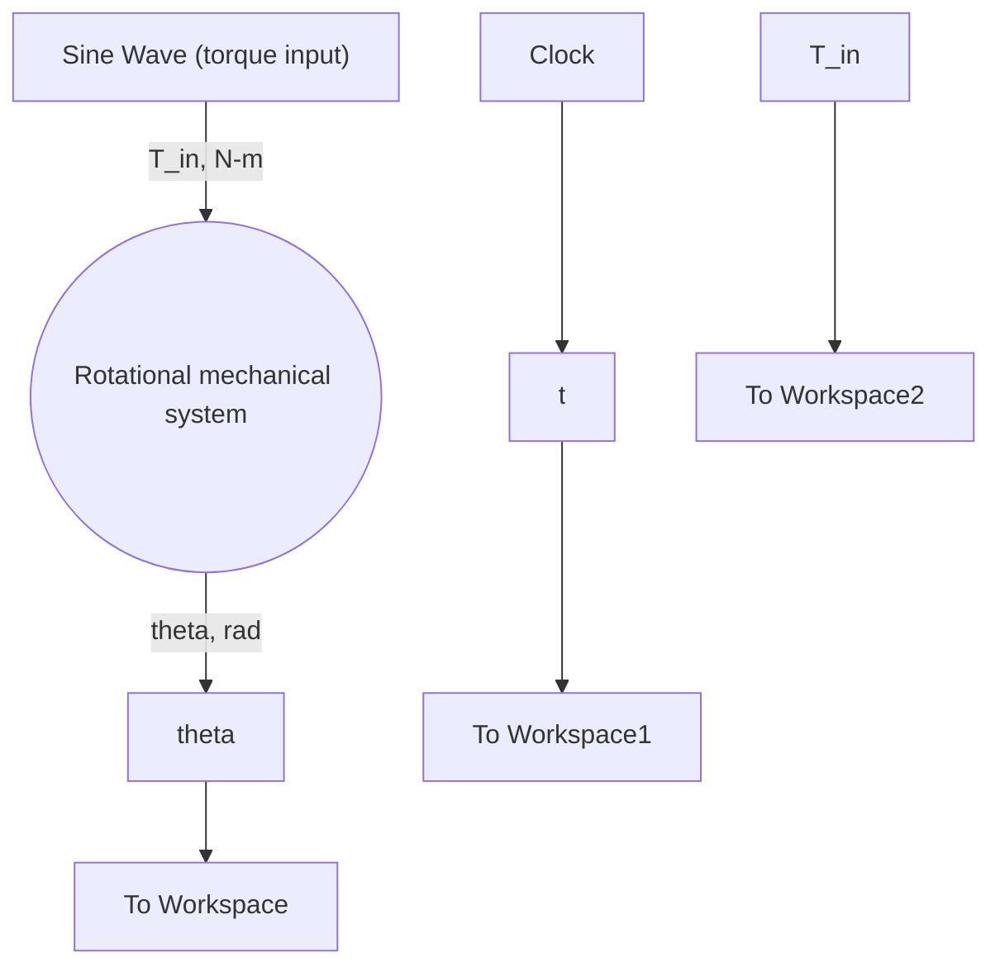

Equation (9.33) is the frequency response of the rotational mechanical system. The amplitude of the angular position response is 0.0521 rad or $2 . { \overset { \cdot } { 9 9 } } ^ { \circ }$ . The phase lag between the input and output sine waves is 1.5639 rad or $8 9 . 6 ^ { \circ }$ .

Figure 9.10 shows the Simulink model of the 1-DOF rotational mechanical system that consists of the single transfer function (9.30) with a sinusoidal input (Sine Wave block from the Simulink Sources library). The Amplitude and Frequency in the Sine Wave dialog box are set to 1.5 (N-m) and 18 (rad/s), respectively. Figure 9.11 shows the response of the rotational mechanical system to the sinusoidal torque input. The angular position ??(t) exhibits a transient response as the amplitude increases and eventually reaches its steady-state value of about 0.052 rad (the settling time for this system is 1 s; see Example 7.8). At steady state the input and output sinusoids clearly have the same frequency (period). Note that the frequency response $\theta _ { \mathrm { s s } } ( t )$ in Fig. 9.11 displays a one-quarter-cycle shift (lag) with respect to the input (i.e., when the input $T _ { \mathrm { i n } } ( t )$ crosses zero the output ??(t) is at its maximum or minimum value). This one-quarter-cycle lag relates to a (negative) phase angle of $- 2 \pi / 4 = - 1 . 5 7 0 8$ rad (−90∘), which closely matches the phase angle of G( j18), that is, $\phi = - 1 . 5 6 3 9$ rad.

flowchart

Figure 9.10 Simulink model of the rotational mechanical system (Example 9.3).

line

| Time, s | Input torque, T_in(t), N-m | Angular position, θ(t), rad |
| --- | --- | --- |
| 0.0 | 0.0 | 0.0 |
| 0.5 | 1.5 | 0.04 |
| 1.0 | -1.5 | -0.02 |
| 1.5 | 1.5 | 0.06 |
| 2.0 | -1.5 | -0.06 |

Figure 9.11 Rotational mechanical system response to a sinusoidal torque input (Example 9.3).
