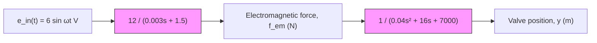

Figure 9.12 Solenoid actuator and spool valve for Example 9.4.

Substituting the input frequency ?? = 62.8319 rad/s in Eq. (9.38) we obtain

$$G (j 6 2. 8 3 1 9) = \frac {1 2}{1 0 , 0 7 3 . 6 3 + j 2 7 9 7 . 6 7} \tag {9.39}$$

The magnitude of G( j62.8319) is

$$| G (j 6 2. 8 3 1 9) | = \frac {\sqrt {1 2 ^ {2} + 0 ^ {2}}}{\sqrt {1 0 , 0 7 3 . 6 3 ^ {2} + 2 7 9 7 . 6 7 ^ {2}}} = 0. 0 0 1 1 4 8$$

The phase angle of $G ( j \omega )$ is computed by subtracting the phase angle of the denominator from the phase angle of the numerator, or

$$
\begin{array}{l} \phi = \angle G (j 6 2. 8 3 1 9) = \angle (1 2 + j 0) - \angle (1 0, 0 7 3. 6 3 + j 2 7 9 7. 6 7) \\ = \tan^ {- 1} \left(\frac {0}{1 2}\right) - \tan^ {- 1} \left(\frac {2 7 9 7 . 6 7}{1 0 , 0 7 3 . 6 3}\right) = 0 - 0. 2 7 0 9 \mathrm{rad} \\ \end{array}
$$

Finally, substituting the magnitude and phase angle of $G ( j \omega )$ into Eq. (9.36) the frequency response becomes

$$y _ {\mathrm{ss}} (t) = 0. 0 0 6 8 8 7 \sin (6 2. 8 3 1 9 t - 0. 2 7 0 9) \quad \mathrm{m} \tag {9.40}$$

Equation (9.40) is the frequency response of the spool-valve position for a 10-Hz voltage input with a magnitude of 6 V. The steady-state amplitude of the valve is 0.0069 m (or 6.9 mm) and the phase lag is 0.2709 rad (or 15.52∘).
